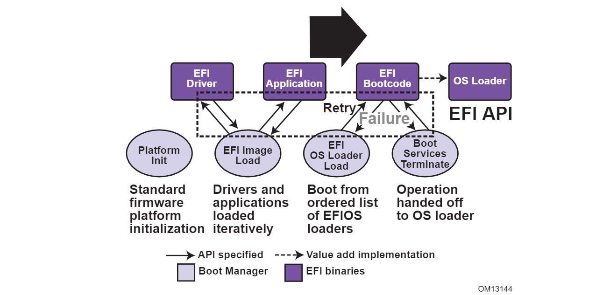

# 概述

---

UEFI 允许通过加载 UEFI 驱动程序和 UEFI 应用程序映像来扩展平台固件。加载 UEFI 驱动程序和 UEFI 应用程序后，它们可以访问所有 UEFI 定义的运行时和启动服务。见图2-1

---

---

UEFI 允许将来自 OS 加载程序和平台固件的引导菜单合并到单个平台固件菜单中。这些平台固件菜单，将允许从 UEFI 引导服务支持的任何引导介质上的任何分区中选择任何 UEFI OS 加载程序。 UEFI OS 加载程序可以支持可以出现在用户界面上的多个选项。还可以包括传统引导选项，例如从平台固件引导菜单中的 A: 或 C: 驱动器引导。

UEFI 支持从包含 UEFI 操作系统加载程序或 UEFI 定义的系统分区的媒介引导。 UEFI 需要 UEFI 定义的系统分区才能从块设备引导。 UEFI 不需要对分区的第一个扇区进行任何更改，因此可以构建媒介在旧架构和 UEFI 平台上启动。
