# 概述

---

UEFI 允许通过加载 UEFI 驱动程序和 UEFI 应用程序镜像来扩展平台固件。加载 UEFI 驱动程序和 UEFI 应用程序后，它们可以访问所有 UEFI 定义的运行时和启动服务。见图 2-1

---


---

UEFI 允许将来自 OS 加载程序和平台固件的启动菜单合并到单个平台固件菜单中。这些平台固件菜单，将允许从 UEFI 启动服务支持的任何启动介质上的任何分区中选择任何 UEFI OS 加载程序。UEFI OS 加载程序可以支持用户界面上的多个选项。还可以包括传统启动选项，例如从平台固件启动菜单中的 `A:` 或 `C:` 驱动器启动。

UEFI 支持从包含 UEFI 操作系统加载程序或 UEFI 定义的系统分区的媒介启动。UEFI 需要 UEFI 定义的系统分区才能从块设备启动。UEFI 不需要对分区的第一个扇区进行任何更改，因此可以构建媒介并在旧架构和 UEFI 平台上启动。

## 启动管理器

UEFI 包含一个启动管理器，它允许加载符合本规范的应用程序或者驱动程序，这些程序可以放在任何符合 UEFI 规范的文件系统上。它也允许通过使用 UEFI 定义的镜像加载服务来加载符合该规范编写的应用程序（包括操作系统第一阶段加载器）或 UEFI 驱动程序。UEFI 定义了 NVRAM 变量，用来指向要加载的文件。这些变量还包含直接传递给 UEFI 应用程序的应用程序特定数据。这些变量还包含一个可读的字符串，可以在菜单中显示给用户。

UEFI 定义的变量允许系统固件包含一个启动菜单，可以指向所有的操作系统，甚至是同一操作系统的多个版本。UEFI 的设计目标是要有一套可以在平台固件中存在的启动菜单。UEFI 只指定了用于选择启动选项的 NVRAM 变量。UEFI 将菜单系统的实现作为增值的实现空间。

UEFI 大大扩展了系统的启动灵活性，超过了目前 PC-AT 级系统的技术状态。今天的 PC-AT 级系统被限制在从第一个软盘、硬盘、CD-ROM、USB 键或连接到系统的网卡启动。从一个普通的硬盘驱动器启动会导致操作系统之间的许多互操作性问题，以及同一供应商的不同版本的操作系统。

### UEFI 镜像

UEFI 镜像是由 UEFI 定义的一类文件，包含可执行代码。UEFI 镜像最突出的特点是，UEFI 镜像文件的第一组字节包含一个镜像头，定义了可执行镜像的编码。

UEFI 使用 PE32+镜像格式的一个子集，并修改了头签名。对 PE32+镜像中签名值的修改是为了将 UEFI 镜像与正常的 PE32 可执行文件区分开来。PE32 的 "+"添加提供了标准 PE32 格式的 64 位重定位修复扩展。

对于具有 UEFI 镜像签名的镜像，PE 镜像头中的 *`Subsystem`* 值定义如下。镜像类型之间的主要区别是固件将镜像加载到的内存类型，以及镜像的入口点退出或返回时采取的行动。当控制权从镜像入口点返回时，UEFI 应用程序镜像总是被卸载。一个 UEFI 驱动镜像只有在控制权被传回，并有 UEFI 错误代码时才被卸载。

```C
// PE32+ Subsystem type for EFI images
#define EFI_IMAGE_SUBSYSTEM_EFI_APPLICATION         10
#define EFI_IMAGE_SUBSYSTEM_EFI_BOOT_SERVICE_DRIVER 11
#define EFI_IMAGE_SUBSYSTEM_EFI_RUNTIME_DRIVER      12
// PE32+ Machine type for EFI images
#define EFI_IMAGE_MACHINE_IA32                      0x014c
#define EFI_IMAGE_MACHINE_IA64                      0x0200
#define EFI_IMAGE_MACHINE_EBC                       0x0EBC
#define EFI_IMAGE_MACHINE_x64                       0x8664
#define EFI_IMAGE_MACHINE_ARMTHUMB_MIXED            0x01C2 
#define EFI_IMAGE_MACHINE_AARCH64                   0xAA64
#define EFI_IMAGE_MACHINE_RISCV32                   0x5032
#define EFI_IMAGE_MACHINE_RISCV64                   0x5064
#define EFI_IMAGE_MACHINE_RISCV128                  0x5128
```

**注意**：选择这种镜像类型是为了使 UEFI 镜像包含 Thumb 和 Thumb2 指令，同时将 EFI 接口本身定义为 ARM 模式。


在 PE 镜像文件头中的 `Machine` 值是用来指示镜像的机器码类型。带有 UEFI 镜像签名的镜像的机器码类型定义如下。一个给定的平台必须实现该平台的本地镜像类型和 EFI 字节码（EBC）的镜像类型。对其他机器码类型的支持对平台来说是可选的。

UEFI 镜像是通过`EFI_BOOT_SERVICES.LoadImage()`启动服务加载到内存中。这个服务将一个 PE32+格式的镜像加载到内存中。这个 PE32+加载器需要将 PE32+镜像的所有部分加载到内存中。一旦镜像被加载到内存中，并进行了适当的修复，根据处理器（32 位，64 位或 128 位）的应用程序的正常间接调用惯例，控制权被转到到 *`AddressOfEntryPoint`* 处的镜像。所有其他与 UEFI 镜像的链接都是通过编程完成的。

### UEFI 应用程序

根据该规范编写的应用程序，由启动管理器或其他 UEFI 应用程序加载。为了加载 UEFI 应用程序，固件会分配足够的内存来容纳镜像，将 UEFI 应用程序镜像中的部分复制到分配的内存中，并应用所需的重定位修复。重定位完成后，分配的内存将被设置为镜像的代码和数据。然后控制权被转移到 UEFI 应用程序的入口点。当应用程序从其入口点返回时，或者当它调用启动服务`EFI_BOOT_SERVICES.Exit()`时，UEFI 应用程序被从内存中卸载，控制权被返回到加载 UEFI 应用程序的 UEFI 组件。

当 Boot Manager 加载一个 UEFI 应用程序时，镜像句柄可被用来定位 UEFI 应用程序的"加载选项"。加载选项存储在非易失性存储器中，与正在加载的 UEFI 应用程序相关，并由 Boot Manager 执行。

### UEFI 操作系统加载器

UEFI 操作系统加载器（UEFI OS Loader）是一种特殊类型的 UEFI 应用程序，通常从符合本规范的固件中接管对系统的控制。当加载时，UEFI 操作系统加载器的行为与其他 UEFI 应用程序一样，它只能使用它从固件中分配的内存，并且只能使用 UEFI 服务和协议来访问固件所暴露的设备。如果 UEFI 操作系统加载器包含任何启动服务类型的驱动函数，它必须使用适当的 UEFI 接口来获得对总线特定资源的访问。也就是说，I/O 和内存映射的设备寄存器，必须通过总线特定的 I/O 调用来访问，就像 UEFI 驱动程序所执行的那样。

如果 UEFI 操作系统加载器遇到问题，不能正确加载其操作系统，它可以释放所有分配的资源，并通过启动服务 `Exit()` 调用将控制权返回给固件。`Exit()` 调用允许返回一个错误代码和 *`ExitData`*。*`ExitData`* 包含一个字符串和操作系统加载器特定的数据。

如果 UEFI 操作系统加载器成功加载其操作系统，它可以通过使用启动服务 `EFI_BOOT_SERVICES.ExitBootServices()` 来控制系统。在成功调用 `ExitBootServices()` 后，系统中所有的启动服务被终止，包括内存管理，UEFI 操作系统加载器负责系统的继续运行。

### UEFI 驱动

UEFI 驱动程序是由启动管理器、符合本规范的固件或其他 UEFI 应用程序加载的。为了加载 UEFI 驱动程序，固件会分配足够的内存来容纳镜像，将 UEFI 驱动程序镜像中的部分复制到分配的内存中，并应用需要的重定位修复。一旦完成，分配的内存就会被保存代码和数据类型，以用于镜像。然后控制权被转移到 UEFI 驱动的入口点。当 UEFI 驱动从其入口点返回时，或者当它调用启动服务 `EFI_BOOT_SERVICES.Exit()` 时，UEFI 驱动被选择性地从内存中卸载，控制被返回到加载 UEFI 驱动的组件。如果 UEFI 驱动程序返回的状态码是 `EFI_SUCCESS`，它就不会从内存中卸载。如果 UEFI 驱动的返回代码是一个错误的状态代码，那么该驱动将从内存中卸载。

有两种类型的 UEFI 驱动：启动服务驱动（boot service drivers）和运行时驱动（runtime drivers）。这两种驱动类型的唯一区别是，UEFI 运行时驱动是在 UEFI 操作系统加载器通过启动服务 `EFI_BOOT_SERVICES.ExitBootServices()` 控制了平台之后才可用。

当 `ExitBootServices()` 被调用时，UEFI 启动服务驱动被终止，UEFI 启动服务驱动所占用的所有内存资源被释放，以便在操作系统环境中使用。

当操作系统调用 `SetVirtualAddressMap()` 时，`EFI_IMAGE_SUBSYSTEM_EFI_RUNTIME_DRIVER` 类型的运行时驱动程序运行在虚拟地址上。

## 固件核心

本节概述了 UEFI 定义的服务。这些服务包括启动服务和运行时服务。

### UEFI 服务

UEFI 接口的目的是定义一个通用的启动环境抽象，供加载的 UEFI 镜像使用，其中包括 UEFI 驱动程序、UEFI 应用程序和 UEFI 操作系统加载器。这些调用被定义为一个完整的 64 位接口，这样就为未来的发展留出了空间。这套抽象的平台调用的目标是允许平台和操作系统独立发展和创新。同时，一套标准的原始运行时服务（TODO）可以被操作系统使用。

本节中定义的平台接口允许使用标准的即插即用 Option ROM，作为启动服务的基本实现方法。这些接口被设计成可以映射到传统的接口。这些接口并没有受到传统 Option ROM 的任何限制。

UEFI 平台接口的目的是在平台和平台上启动的操作系统之间提供一个抽象。UEFI 规范还提供了诊断程序或实用程序与平台之间的抽象性。但是，它并不试图实现一个完整的诊断操作系统环境。我们设想在 UEFI 系统上可以很容易地建立一个类似诊断操作系统的小环境。本规范没有描述这样的诊断环境。

本规范增加的接口分为以下几类，并在本文件后面详细介绍：

- 运行时服务
- 启动服务接口，有以下子类：
  - 全局启动服务接口
  - 基于设备句柄的启动服务接口
  - 设备协议
  - 协议服务

### 运行时服务

本节介绍 UEFI 运行时服务功能。运行时服务的主要目的是将平台的硬件实现的次要部分从操作系统中抽象出来。运行时服务功能在启动过程中可用，在运行时也可用，前提是操作系统切换到平面物理寻址模式来进行运行时调用。然而，如果操作系统加载器或操作系统使用运行时服务 `SetVirtualAddressMap()` 服务，操作系统将只能在虚拟寻址模式下调用运行时服务。所有的运行时接口都是非阻塞接口，如果需要的话，可以在禁用中断的情况下调用。为了确保与现有平台的最大兼容性，建议将所有构成运行时服务的 UEFI 模块在 `MemoryMap` 中表示为类型为 `EfiRuntimeServicesCode` 的单一 `EFI_MEMORY_DESCRIPTOR`。

在所有情况下，运行时服务使用的内存必须被保留，不被操作系统使用。运行时服务的内存总是对 UEFI 函数可用，绝不会被操作系统或其组件直接操纵。UEFI 负责定义运行时服务使用的硬件资源，因此当运行时服务调用时，操作系统可以与这些资源同步，或者保证操作系统永远不使用这些资源。

表 2-2 列出了运行时服务包含的函数。

| 函数名 | 功能描述 |
| :----: | :----: |
| GetTime() | 返回当前硬件时间、时间上下文和时钟性能。 |
| SetTime() | 设置当前硬件时间和时间上下文（TODO）。 |
| GetWakeupTime() | 返回当前的唤醒定时器的状态。 |
| SetWakeupTime() | 设置当前唤醒定时器（启用或禁用）。 |
| GetVariable() | 返回系统变量的值。 |
| GetNextVariableName() | 枚举所有系统变量。 |
| SetVariable() | 设置并在需要时创建一个系统变量。 |
| SetVirtualAddressMap() | 将所有运行时函数从物理寻址切换到虚拟寻址。 |
| ConvertPointer() | 用于将一个指针从物理寻址转换为虚拟寻址。 |
| GetNextHighMonotonicCount() | 包含平台的单调计数器功能。 |
| ResetSystem() | 重置所有处理器和设备并重新启动系统。 |
| UpdateCapsule() | 用虚拟和物理映射将胶囊（TODO）传递给固件。 |
| QueryCapsuleCapabilities() | 返回是否可以通过 UpdateCapsule() 支持胶囊。（TODO） |
| QueryVariableInfo() | 返回有关 EFI 变量存储的信息。 |

> 译者注：时钟性能，用 EFI_TIME_CAPABILITIES 表示，包括分辨率，精度等指标。

## 调用约定

除非另有说明，UEFI 规范中定义的所有函数都是通过 C 语言编译器中常见的、架构上定义的调用惯例中的指针来调用。各种全局 UEFI 函数的指针在 `EFI_RUNTIME_SERVICES` 和 `EFI_BOOT_SERVICES` 表中找到，它们通过系统表（System Table）定位。对本规范中定义的其他函数的指针通过设备句柄动态地定位。在所有情况下，指向 UEFI 函数的指针都用 `EFIAPI` 这个词来转换。这允许每个架构的编译器提供适当的编译器关键字以实现所需的调用约定。当向启动服务、运行时服务和协议接口传递指针参数时，调用者有以下责任：

- 传递引用物理内存位置的指针参数是调用者的责任。如果传递的指针没有指向物理内存位置（即内存映射的 I/O 区域），结果是不可预测的，系统可能会停止运行。
- 调用者有责任以正确的对齐方式传递指针参数。如果一个未对齐的指针被传递给一个函数，其结果是不可预测的，系统可能会停止运行。
- 除非明确允许，否则调用者不要向函数传递一个 `NULL` 参数。如果一个 `NULL` 指针被传递给一个函数，其结果是不可预测的，系统可能会挂起。
- 除非另有说明，如果函数以错误方式返回，调用者不应该对指针参数的状态做任何假设。
- 调用者不得按值传递大于本机寻址宽度的结构，这些结构必须由调用者通过引用（通过指针）传递。在堆栈中传递大于本机宽度（在支持的 32 位处理器上为 4 字节；在支持的 64 位处理器指令上为 8 字节）的结构将产生未定义的结果。

支持的 32 位和支持的 64 位应用程序的调用惯例在下文有更详细的描述。任何函数或协议都应该返回有效的返回代码。

一个 UEFI 模块的所有公共接口必须遵循 UEFI 的调用惯例。公共接口包括镜像入口点、UEFI 事件处理程序和协议成员函数。EFIAPI 类型被用来表示符合本节中定义的调用惯例。非公共接口，如私有函数和静态库调用，不需要遵循 UEFI 的调用约定，并可能被编译器优化。

### 数据类型

表 2-3 列出了接口定义中使用的常见数据类型，表 2-4 列出了它们的修饰语。除非另有规定，所有数据类型都是自然对齐的。结构在等于结构最大内部基准的边界上对齐，内部数据被隐含地填充以实现自然对齐。

传入或由 UEFI 接口返回的指针值必须为底层类型提供自然对齐。

| 记号 | 描述 |
| :----: | :----: |
| BOOLEAN | 逻辑布尔值。1 字节的值，0 代表 FALSE 或 1 代表 TRUE。其他值是未定义的。 |
| INTN | 本地宽度的有符号的值。(在支持的 32 位处理器指令上为 4 字节，在支持的 64 位处理器指令上为 8 字节，在支持的 128 位处理器指令上为 16 字节)。 |
| UINTN | 本地宽度的无符号值。(在支持的 32 位处理器指令上为 4 字节，在支持的 64 位处理器指令上为 8 字节，在支持的 128 位处理器指令上为 16 字节）。 |
| INT8 | 1 字节有符号值。 |
| UINT8 | 1 字节无符号值。 |
| INT16 | 2 字节有符号值。 |
| UINT16 | 2 字节无符号值。 |
| INT32 | 4 字节有符号值。 |
| UINT32 | 4 字节无符号值。 |
| INT64 | 8 字节有符号值。 |
| UINT64 | 8 字节无符号值。 |
| INT128 | 16 字节有符号值。 |
| UINT128 | 16 字节无符号值。 |
| CHAR8 | 1 字节的字符。除非另有规定，所有 1 字节或 ASCII 字符和字符串都以 8 位 ASCII 编码格式存储，使用 ISO-拉丁文 1 字符集。 |
| CHAR16 | 2 字节字符。除非另有规定，所有字符和字符串都以 UCS-2 编码格式存储，该格式由 Unicode 2.1 和 ISO/IEC 10646 标准定义。 |
| VOID | 未声明的类型。 |
| EFI_GUID | 128 位缓冲区，包含一个唯一的标识符值。除非另有规定，否则在 64 位边界对齐。 |
| EFI_STATUS | 状态代码。类型为 UINTN。 |
| EFI_HANDLE |  一个相关接口的集合。类型 VOID *。 |
| EFI_EVENT | 一个事件结构的指针。类型 VOID *。 |
| EFI_LBA | 逻辑块地址。类型 UINT64。 |
| EFI_TPL | 任务优先级别。类型为 UINTN。 |
| EFI_MAC_ADDRESS | 32 字节的缓冲区，包含一个网络媒体访问控制地址。 |
| EFI_IPv4_ADDRESS | 4 字节的缓冲区。一个 IPv4 互联网协议地址。 |
| EFI_IPv6_ADDRESS | 16 字节的缓冲区。一个 IPv6 互联网协议地址。 |
| EFI_IP_ADDRESS | 16 字节的缓冲区，以 4 字节为边界对齐。一个 IPv4 或 IPv6 互联网协议地址。 |
| <枚举类型>  | 标准 ANSI C 枚举类型声明的元素。类型 INT32.或 UINT32。ANSI C 没有定义枚举的符号大小，所以它们不应该在结构中使用。ANSI C 的整数推广规则使 INT32 或 UINT32 在作为参数传递给函数时可以互换。 |
| sizeof (VOID *) | 在支持的 32 位处理器指令上是 4 字节。在支持的 64 位处理器指令上为 8 字节。在支持的 128 位处理器上为 16 字节。 |
| 比特域 | 比特域的排序：第 0 位是最不重要的位。 |

| 记号 | 描述 |
| :----: | :----: |
| IN | Datum 被传递给函数。 |
| OUT | Datum 从函数中返回。 |
| OPTIONAL | 向函数传递数据点是可选的，如果不提供数据点的值，可以传递 `NULL`。 |
| CONST | Datum 是只读的。 |
| EFIAPI | 定义了 UEFI 接口的调用惯例。 |

### IA32 平台

所有的函数都是按照 C 语言的调用惯例来调用的。在整个函数调用过程中都是 `volatile` 的通用寄存器是 `eax`, `ecx`, 和 `edx`。所有其他的通用寄存器都是`nonvolatile`的，并且被目标函数保留下来。此外，除非函数定义另有规定，所有其他的寄存器都被保留。

在操作系统调用 `ExitBootServices()` 之前，固件启动服务和运行时服务以下列处理器执行模式运行：

- 单处理器，在下列参考资料的第 8 章详细描述：
  - Intel 64 and IA-32 Architectures Software Developer's Manual
  - Volume 3, System Programming Guide, Part 1
  - Order Number: 253668-033US, December 2009
  - See [Links to UEFI-Related Documents](http://uefi.org/uefi) under the heading Intel Processor Manuals
- 保护模式
- 可以启用分页模式。如果启用了分页模式，推荐使用 PAE（Physical Address Extensions，物理地址扩展）模式。如果启用了分页模式，则 UEFI 内存映射定义的任何内存空间都是标识映射的（虚拟地址等于物理地址）。对其他区域的映射是未定义的，可能因实施情况不同而不同。
- 选择器（Selectors）被设置为平坦，除此之外不使用。
- 中断被启用--尽管除了 UEFI 启动服务的定时器功能外，不支持任何中断服务（所有加载的设备驱动都是通过“轮询”同步服务的）。
- EFLAG 中的方向标志是明确的。
- 其他通用标志寄存器未定义。
- 128 KiB 或更多可用堆栈空间。
- 堆栈必须是 16 字节对齐的。堆栈可以在身份（TODO）映射的页面表中被标记为不可执行。
- 浮点控制字必须被初始化为 `0x027F`（所有例外都被屏蔽，双精度，四舍五入）。
- 多媒体扩展控制字（如果支持的话）必须被初始化为 `0x1F80`（所有例外都被屏蔽了，四舍五入，屏蔽下溢时冲到零）。
- CR0.EM 必须为零。
- CR0.TS 必须为零。

根据本规范编写的应用程序可以改变处理器的执行模式，但 UEFI 镜像必须确保固件启动服务和运行时服务以规定的执行环境执行。

在操作系统调用 `ExitBootServices()` 后，固件启动服务不再可用，调用任何启动服务都是非法的。在 `ExitBootServices` 之后，固件运行服务仍然可用，如果 `SetVirtualAddressMap()` 被调用描述了固件运行服务使用的所有虚拟地址范围，则可以在启用分页和虚拟地址指针的情况下调用。

一个操作系统要使用任何 UEFI 运行时服务，必须：

- 保留内存映射中所有标记为运行时代码和运行时数据的内存；
- 调用运行时服务函数，条件如下：
  - 在保护模式下；
  - 分页可能会也可能不会被启用，但是如果分页被启用并且 `SetVirtualAddressMap()` 没有被调用，任何由 UEFI 内存映射定义的内存空间都是身份（TODO）映射的（虚拟地址等于物理地址），尽管某些区域的属性可能没有所有的读、写和执行属性，或者为了平台保护的目的没有标记。对其他区域的映射是未定义的，可能因实现不同而不同。调用此函数后，有关内存映射的详细信息，请参见 `SetVirtualAddressMap()` 的描述。
  - EFLAGs 中的方向标志清除；
  - 4 KiB 或更多的可用堆栈空间；
  - 堆栈必须是 16 字节对齐的；
  - 浮点控制字必须被初始化为 `0x027F`（所有例外都被屏蔽，双精度，四舍五入）；
  - 多媒体扩展控制字（如果支持）必须初始化为 `0x1F80`（所有异常都被屏蔽、四舍五入、为屏蔽下溢刷新为零）；
  - CR0.EM 必须为零；
  - CR0.TS 必须为零；
  - 由调用者决定禁用或启用中断功能；
- 在启动时加载的 ACPI 表可以包含在 `EfiACPIReclaimMemory`（推荐）或 `EfiACPIMemoryNVS` 类型的内存中。ACPI FACS 必须包含在 `EfiACPIMemoryNVS` 类型的内存中；
- 系统固件不得为任何 `EfiACPIReclaimMemory` 或 `EfiACPIMemoryNVS` 类型的内存描述符请求虚拟映射；
- `EfiACPIReclaimMemory` 和 `EfiACPIMemoryNVS` 类型的 EFI 内存描述符必须在 4KiB 边界上对齐，并且必须是 4KiB 的倍数；
- 任何通过 `EFI_MEMORY_DESCRIPTOR` 请求虚拟映射的 UEFI 内存描述符，如果设置了 `EFI_MEMORY_RUNTIME` 位，必须在 4KiB 边界上对齐，并且必须是 4KiB 的倍数；
- ACPI 内存操作区域必须从 UEFI 内存映射中继承可缓存属性。如果系统内存映射不包含可缓存属性，ACPI 内存操作区域必须从 ACPI 命名空间中继承其可缓存属性。如果在系统内存映射或 ACPI 命名空间中不存在可缓存属性，那么该区域必须被认为是不可缓存的。
- 在运行时加载的 ACPI 表必须包含在 `EfiACPIMemoryNVS` 类型的内存中。运行时加载的 ACPI 表的可缓存属性应在 UEFI 内存映射中定义。如果 UEFI 内存映射中不存在关于表位置的信息，可从 ACPI 内存描述符中获得缓存属性。如果 UEFI 内存映射或 ACPI 内存描述符中没有关于表位置的信息，则假定该表为非缓存的。
- 一般来说，在启动时加载的 UEFI 配置表（例如，SMBIOS 表）可以包含在 `EfiRuntimeServicesData`（推荐）、`EfiBootServicesData`、`EfiACPIReclaimMemory` 或 `EfiACPIMemoryNVS` 类型的内存中。在运行时加载的表必须包含在 `EfiRuntimeServicesData`（推荐）或 `EfiACPIMemoryNVS` 类型的内存中。

**注意**：以前的 EFI 规范允许在运行时加载的 ACPI 表在 `EfiReservedMemoryType` 中，对于其他 EFI 配置表没有提供指导。`EfiReservedMemoryType` 不打算用于存储任何 EFI 配置表。另外，只有符合 UEFI 规范的操作系统才能保证处理 `EfiBootServicesData` 类型内存中的 SMBIOS 表。

#### 切换状态

加载 32 位 UEFI 操作系统时，系统固件将控制权移交给平面 32 位模式下的操作系统。所有描述符都设置为它们的 4GiB 限制，以便可以从所有段访问所有内存。

图 2-2 显示在支持的 32 位系统上，镜像的 PE32+头中的 `AddressOfEntryPoint` 被调用后的堆栈。所有的 UEFI 镜像入口点都需要两个参数。这两个参数是 UEFI 镜像的句柄，以及一个指向 EFI 系统表的指针。


#### 调用约定

所有的函数都是按照 C 语言的调用惯例来调用的。在整个函数调用过程中的`volatile`寄存器是 `eax`, `ecx`, 和 `edx`。所有其他的通用寄存器都是`nonvolatile`的，并由目标函数保留。

此外，除非函数定义另有规定，所有其他 CPU 寄存器（包括 MMX 和 XMM）都被保留。

浮点状态寄存器不被目标函数保留。浮点控制寄存器和 MMX 控制寄存器由目标函数保存。

如果返回值是浮点数或双精度浮点类型，则以 `ST(0)` 返回。

### 基于 Intel® Itanium® 的平台

UEFI 作为 SAL 执行环境的扩展来执行，其规则与 SAL 规范所规定的相同。

在启动服务时间内，处理器处于以下执行模式：

- 单处理器，详见以下参考资料的第 13.1.2 章：
  - Intel Itanium Architecture Software Developer's Manual
  - Volume 2: System Architecture
  - Revision 2.2
  - January 2006
  - See [Links to UEFI-Related Documents](http://uefi.org/uefi) under the heading "Intel Itanium Documentation"
  - Document Number: 245318-005
- 物理模式
- 128 KiB 或更多可用堆栈空间；
- 16 KiB 或更多的可用备份存储空间；
  - FPSR.traps：设置为全 1（禁用所有异常）；
  - FPSR.sf0:
  - .pc:Precision Control - 11b (extended precision)
  - .rc:Rounding Control - 0 (round to nearest)
  - .wre:Widest Range Exponent - 0 (IEEE mode)
  - .ftz:Flush-To-Zero mode - 0 (off)
  - FPSR.sf1:
  - .td:Traps Disable = 1 (traps disabled)
  - .pc:Precision Control - 11b (extended precision)
  - .rc:Rounding Control - 0 (round to nearest)
  - wreWidest Range Exponent - 1 (full register exponent range)
  - ftzFlush-To-Zero mode - 0 (off)
  - FPSR.sf2,3:
  - .tdTraps Disable = 1 (traps disabled)
  - pc:Precision Control - 11b (extended precision)
  - .rc:Rounding Control - 0 (round to nearest)
  - .wre:Widest Range Exponent - 0 (IEEE mode)
  - .ftz:Flush-To-Zero mode - 0 (off)

根据本规范编写的应用程序可以改变处理器的执行模式，但 UEFI 镜像必须确保固件启动服务和运行时服务以规定的执行环境执行。

在操作系统调用 `ExitBootServices()` 后，固件启动服务不再可用，调用任何启动服务都是非法的。在 `ExitBootServices` 之后，固件运行时服务仍然可用，当调用运行时服务时，分页可能被启用，也可能不被启用，但是如果分页被启用并且 `SetVirtualAddressMap()` 没有被调用，任何由 UEFI 内存映射定义的内存空间都是身份映射（TODO）的（虚拟地址等于物理地址）。对其他区域的映射是未定义的，可能因实现不同而不同。参见 `SetVirtualAddressMap()` 的描述，了解该函数被调用后内存映射的细节。在 `ExitBootServices()` 之后，运行时服务函数可以在禁用或启用中断的情况下被调用，由调用者决定。

- 在启动时加载的 ACPI 表可以包含在 `EfiACPIReclaimMemory`（推荐）或 `EfiACPIMemoryNVS` 类型的内存中。ACPI FACS 必须包含在 `EfiACPIMemoryNVS` 类型的内存中。
- 系统固件不得为任何 `EfiACPIReclaimMemory` 或 `EfiACPIMemoryNVS` 类型的内存描述符请求虚拟映射。
- EFI 内存描述符的类型 `EfiACPIReclaimMemory` 和 `EfiACPIMemoryNVS`，必须在 8KiB 边界上对齐，并且大小必须是 8KiB 的倍数。
- 任何通过 `EFI_MEMORY_DESCRIPTOR` 请求虚拟映射的 UEFI 内存描述符，如果设置了 `EFI_MEMORY_RUNTIME` 位，必须在 8KiB 边界上对齐，并且大小必须是 8KiB 的倍数。
- ACPI 内存操作区域必须从 UEFI 内存映射中继承可缓存属性。如果系统内存映射不包含缓存属性，ACPI 内存操作区域必须从 ACPI 命名空间中继承其缓存属性。
- 如果没有可缓存性属性在系统内存映射或 ACPI 命名空间中存在，那么该区域必须被认为是不可缓存的。
- 在运行时加载的 ACPI 表必须包含在 `EfiACPIMemoryNVS` 类型的内存中。运行时加载的 ACPI 表的可缓存属性应在 UEFI 内存映射中定义。如果 UEFI 内存映射中不存在关于表位置的信息，可从 ACPI 内存描述符中获得缓存属性。如果 UEFI 内存映射或 ACPI 内存描述符中没有关于表位置的信息，则假定该表为非缓存的（non-cacheable）。
- 一般来说，启动时加载的配置表（如 SMBIOS 表）可以包含在 `EfiRuntimeServicesData`（推荐）、`EfiBootServicesData`、`EfiACPIReclaimMemory` 或 `EfiACPIMemoryNVS` 类型的内存中。在运行时加载的表必须包含在 `EfiRuntimeServicesData`（推荐）或 `EfiACPIMemoryNVS` 类型的内存中。

**注意**：以前的 EFI 规范允许在运行时加载的 ACPI 表在 `EfiReservedMemoryType` 中，对其他 EFI 配置表没有提供指导。`EfiReservedMemoryType` 不打算被固件使用。另外，只有符合 UEFI 规范的操作系统才能保证处理 `EfiBootServicesData` 类型内存中的 SMBIOS 表。

详情请参考 IA-64 系统抽象层规范（见附录 Q）。

UEFI 程序以 P64 C 调用约定被调用，这些调用约定为基于 Intel® Itanium®的应用程序定义的。更多信息请参考 *64 Bit Runtime Architecture and Software Conventions for IA-64*（见附录 Q）。

#### 切换状态

UEFI 使用 P64 C 调用约定，这些调用约定是为基于 Itanium 的操作系统定义的。图 2-3 显示了 `ImageEntryPoint` 在基于 Itanium 的系统上被调用后的堆栈。参数也被存储在寄存器中：**out0** 包含 `EFI_HANDLE`，**out1** 包含 `EFI_SYSTEM_TABLE` 的地址。UEFI 镜像的 **gp** 将从镜像的 PE32+头中 `AddressOfEntryPoint` 所指向的 *plabel* 加载。所有的 UEFI 镜像入口点都有两个参数。这两个参数是镜像的句柄和一个指向系统表的指针。


SAL 规范（见附录 Q）定义了系统寄存器在启动交换（handoff）时的状态。SAL 规范还定义了哪些系统寄存器只能在 UEFI 启动服务被正确终止后使用。

#### 调用约定

UEFI 作为 SAL 执行环境的一个扩展来执行，其规则与 SAL 的规定相同。UEFI 程序是使用为基于 Intel® Itanium®的应用程序定义的 P64 C 调用惯例来调用的。请参考文件 *64 Bit Runtime Architecture and Software Conventions for IA-64*（更多信息请参见术语表）。

对于浮点数，函数只能使用较低的 32 个浮点寄存器返回值出现在 f8-f15 寄存器中。单精度值、双精度值和扩展值都使用适当的格式返回。寄存器 f6-f7 是本地寄存器，不为调用者保留。所有其他的浮点寄存器都被保留下来。注意，在编译 UEFI 程序时，可能需要指定一个特殊的开关，以保证编译器不使用 f32-f127，这些寄存器在 Itanium 的常规调用约定中通常不被保留。使用保留的浮点寄存器之一的程序必须保存和恢复调用者的原始内容，而不产生 NaT 消耗故障（NaT consumption fault）。

浮点参数尽可能在 f8-f15 寄存器中传递。超出寄存器的参数出现在内存中，这在 Itanium 软件约定和运行时架构指南的第 8.5 节有解释。在被调用的函数中，这些是本地寄存器，不会为调用者保留。寄存器 f6-f7 是本地寄存器，不为调用者保留。所有其他的浮点寄存器都被保留了。注意，在编译 UEFI 程序时，可能需要指定一个特殊的开关，以保证编译器不使用 f32-f127，这些寄存器在 Itanium 的常规调用约定中通常不被保留。使用保留的浮点寄存器之一的程序必须保存和恢复调用者的原始内容，而不产生 NaT 消耗故障。

浮点状态寄存器必须在对目标函数的调用中被保留。SF1,2,3 中的标志字段不会为调用者保留。返回时 SF0 中的标志字段将反映传入的值，并且位设置为 1，表示在作为被调用者的一部分执行的非推测浮点操作上检测到的任何 IEEE 异常

被调用者执行的浮点操作可能需要软件仿真。调用者必须准备好处理 FP 软件辅助（FPSWA）的中断。被调用者不应该通过将 FPSR.trap 位改为 0，然后执行引起这种 trap 的浮点操作来引发 IEEE traps

### x64 平台

所有的函数都是以 C 语言的调用惯例来调用的。更多细节见 2.3.4.2 节。

在启动服务时间内，处理器处于以下执行模式。

- 单处理器，如第 8.4 章所述：
  - Intel 64 and IA-32 Architectures Software Developer's Manual, Volume 3, System
Programming Guide, Part 1, Order Number: 253668-033US, December 2009
  - 见“Intel Processor Manuals”标题下 UEFI  [相关文件链接](http://uefi.org/uefi)。
- 长模式，64 位模式下；
- 启用分页模式，并且 UEFI 内存映射定义的任何内存空间都是身份映射的（虚拟地址等于物理地址），尽管某些区域的属性可能不具有所有读、写和执行属性，或者出于平台保护的目的未标记。到其他区域的映射，例如未接受内存的映射，是未定义的，并且可能因实现而异；
- 选择器被设置为平坦，除此之外不使用；
- 中断被启用--尽管除了 UEFI 启动服务的定时器功能外，不支持任何中断服务（所有加载的设备驱动都是通过 "轮询 "同步服务的）；
- EFLAG 中的方向标志是明确的；
- 其他通用标志寄存器未定义；
- 128 KiB 或更多可用堆栈空间；
- 堆栈必须是 16 字节对齐的。堆栈可以在身份映射（TODO）的页面表中被标记为不可执行；
- 浮点控制字必须初始化为 0x037F（所有例外都被屏蔽，双倍扩展精度，四舍五入）；
- 多媒体扩展控制字（如果支持的话）必须被初始化为 0x1F80（所有的例外都被屏蔽了，四舍五入，对于屏蔽的下溢，冲到零。）；
- CR0.EM 必须为零；
- CR0.TS 必须为零；

一个操作系统要使用任何 UEFI 运行时服务，必须：

- 保留内存映射中所有标记为运行时代码和运行时数据的内存；
- 调用运行时服务函数，条件如下：
- 在长模式下，在 64 位模式下；
- 开启分页；
- 所有的选择器设置为平坦的，虚拟等于物理地址。如果 UEFI 操作系统加载器或操作系统使用 `SetVirtualAddressMap()` 来重新定位虚拟地址空间中的运行时服务，那么这个条件就不必满足。参见 `SetVirtualAddressMap()` 的描述，以了解该函数被调用后的内存映射的细节；
- EFLAG 中的方向标志清除；
- 4 KiB 或更多可用堆栈空间；
- 堆栈必须是 16 字节对齐的；
- 浮点控制字必须初始化为 0x037F（所有例外都被屏蔽，双倍扩展精度，四舍五入）；
- 多媒体扩展控制字（如果支持的话）必须被初始化为 0x1F80（屏蔽所有异常，四舍五入，屏蔽下溢时刷新为 0）
- CR0.EM 必须为零；
- CR0.TS 必须为零；
- 中断可由调用者决定是否禁用或启用；
- 在启动时加载的 ACPI 表可以包含在 `EfiACPIReclaimMemory`（推荐）或 EfiACPIMemoryNVS 类型的内存中。ACPI FACS 必须包含在 EfiACPIMemoryNVS 类型的内存中；
- 系统固件不得为任何 `EfiACPIReclaimMemory` 或 `EfiACPIMemoryNVS` 类型的内存描述符请求虚拟映射；
- `EfiACPIReclaimMemory` 和 `EfiACPIMemoryNVS` 类型的 EFI 内存描述符必须在 4KiB 边界上对齐，并且大小必须是 4KiB 的倍数；
- 任何通过 `EFI_MEMORY_DESCRIPTOR` 请求虚拟映射的 UEFI 内存描述符，如果设置了 `EFI_MEMORY_RUNTIME` 位，必须在 4KiB 边界上对齐，并且大小必须是 4KiB 的倍数；
- ACPI 内存操作区域必须从 UEFI 内存映射中继承可缓存属性。如果系统内存映射不包含可缓存属性，ACPI 内存操作区域必须从 ACPI 命名空间中继承其可缓存属性。如果在系统内存映射或 ACPI 命名空间中不存在可缓存属性，那么该区域必须被认为是不可缓存的；
- 在运行时加载的 ACPI 表必须包含在 `EfiACPIMemoryNVS` 类型的内存中。运行时加载的 ACPI 表的可缓存属性应在 UEFI 内存映射中定义。如果 UEFI 内存映射中不存在关于表位置的信息，可从 ACPI 内存描述符中获得缓存属性。如果 UEFI 内存映射或 ACPI 内存描述符中没有关于表位置的信息，则假定该表为非缓存的；
- 一般来说，在启动时加载的 UEFI 配置表（例如，SMBIOS 表）可以包含在 `EfiRuntimeServicesData`（推荐）、`EfiBootServicesData`、`EfiACPIReclaimMemory` 或 `EfiACPIMemoryNVS` 类型的内存中。在运行时加载的表必须包含在 EfiRuntimeServicesData（推荐）或 `EfiACPIMemoryNVS` 类型的内存中；

**注意**：以前的 EFI 规范允许在运行时加载的 ACPI 表在 `EfiReservedMemoryType` 中，对其他 EFI 配置表没有提供指导。`EfiReservedMemoryType` 不打算被固件使用。另外，只有符合 UEFI 规范的操作系统才能保证处理 `EfiBootServicesData` 类型内存中的 SMBIOS 表。

#### 切换状态

```text
Rcx – EFI_HANDLE
Rdx – EFI_SYSTEM_TABLE
*RSP - <return address>
```

#### 详细的调用约定

调用者在寄存器中传递前四个整数参数。整数值在 `Rcx`、`Rdx`、`R8` 和 `R9` 寄存器中从左到右传递。调用者将第五个及以上的参数传入堆栈。所有的参数在传递的寄存器中必须是右对齐的。这确保被调用者只能处理寄存器中需要的位。

调用者通过一个指向调用者分配的内存的指针传递数组和字符串。调用者传递大小为 8、16、32 或 64 位的结构和联合体，就像它们是相同大小的整数一样。调用者不允许传递这些大小以外的结构和联合体，必须通过指针传递这些联合体和结构。

如果需要，被调用者必须将寄存器参数转储到其影子空间。最常见的要求是把一个参数的地址。

如果参数是通过 `varargs` 传递的，那么基本上适用于典型的参数传递，包括将第五个和随后的参数放到到堆栈。被调用者必须转存那些地址被占用的参数。

固定在 64 位的返回值会在 `Rax` 寄存器中返回。如果返回值不在 64 位之内，那么调用者必须分配并传递一个返回值的指针作为第一个参数，`Rcx`。随后的参数会向右移动一个参数，例如，参数一会在 `Rdx` 中传递。要返回的用户定义类型必须是 1、2、4、8、16、32 或 64 位的长度。

寄存器 `Rax`, `Rcx` `Rdx` `R8`, `R9`, `R10`, `R11`, 和 `XMM0-XMM5` 是 volatile 的，因此，在函数调用时被销毁。

寄存器 `RBX`、`RBP`、`RDI`、`RSI`、`R12`、`R13`、`R14`、`R15` 和 `XMM6-XMM15` 被认为是 non-volatile 的，必须由使用调用的函数来保存和恢复。

函数指针是指向相应函数标签的指针，不需要特殊处理。

调用者必须总是在堆栈 16 字节对齐的情况下调用。

对于 `MMX`、`XMM` 和浮点值，可以存入 64 位的返回值通过 `RAX` 返回（包括 `MMX` 类型）。然而，`XMM` 的 128 位类型、浮点和双数则在 `XMM0` 中返回。浮点状态寄存器不被目标函数保存。浮点和双精度参数在 `XMM0-XMM3`（最多 4 个）中传递，通常用于该卡槽的整数卡槽（`RCX`、`RDX`、`R8` 和 `R9`）被忽略（见例子），反之亦然。`XMM` 类型从不通过即时值传递，而是通过一个指针传递给调用者分配的内存。MMX 类型将被传递，就像它们是相同大小的整数一样。在没有提供正确的异常处理程序的情况下，被调用者不得解除异常的屏蔽。

#### 在应用程序中启用分页或替代翻译

启动服务定义了一个执行环境，其中不启用分页（支持 32 位）但启用翻译（translations，TODO）并且映射的虚拟地址等于物理地址（x64）。本节将描述如何编写一个具有替代翻译或启用分页的应用程序。一些操作系统要求操作系统加载器能够在启动服务时启用操作系统要求的翻译。

===

如果 UEFI 应用程序使用自己的分页表、GDT 或 IDT，应用程序必须确保固件执行每个被取代的数据结构。当应用程序启用分页时，符合本规范的固件有两种方式可以执行。

- 显式固件调用
- 固件通过定时器事件抢占应用程序

启用翻译的应用程序可以在每次 UEFI 调用之前恢复固件所需的映射。然而，抢占的可能性可能要求启用翻译的应用程序在启用替代翻译时禁用中断。如果应用程序在调用 UEFI 中断 ISR 之前捕捉到中断并恢复 EFI 固件环境，那么翻译启用的应用程序启用中断是合法的。在 UEFI ISR 上下文被执行后，它将返回到翻译启用的应用程序上下文，并恢复应用程序所需的任何映射关系。

### AArch32 平台

所有的函数都是按照第 2.3.5.3 节中规定的 C 语言调用惯例来调用的。此外，如果处理器中存在无符号访问支持，则调用的操作系统可以假定该支持已被启用

在启动服务时间内，处理器处于以下执行模式：

- 如果支持，应启用未对齐访问；否则会启用对齐错误
- 单处理器
- 特权模式
- MMU 被启用（CP15 c1 系统控制寄存器（SCTL）SCTL.M=1），任何由 UEFI 内存映射定义的 RAM 都被身份映射（虚拟地址等于物理地址）。对其他区域的映射是未定义的，可能因实施情况不同而不同。
- 核心将被配置如下（在所有处理器架构的版本中都是通用的）：
  - 启用 MMU
  - 启用指令和数据缓存
  - 禁用访问标识
  - 禁用翻译重映射
  - 小端模式
  - 域访问控制机制（如果支持的话）将被配置为检查页面描述符中的访问许可位
  - 必须禁用快速上下文切换扩展 (FCSE)

这将通过以下方式实现：

- 配置 CP15 c1 系统控制寄存器（SCTLR）如下。i=1, c=1, b=0, tre=0, afe=0, m=1
- 将 CP15 c3 域访问控制寄存器（DACR）配置为 0x33333333。
- 配置 CP15 c1 系统控制寄存器（SCTLR），在 ARMv4 和 ARMv5 上 A=1，在 ARMv6 和 ARMv7 上 A=0，U=1

其他系统控制寄存器位的状态不是由本规范决定的。

启动服务的实现将启用架构上可管理的缓存和 TLB，即那些可以使用《ARM 架构参考手册》中定义的机制和程序直接使用 CP15 操作进行管理的缓存。它们不应启用需要平台信息来管理或调用非架构缓存/TLB 锁定机制的缓存。

MMU 配置--实施时必须只使用 4k 页和一个翻译基础寄存器。在支持多个翻译基础寄存器的设备上，必须只使用 TTBR0。绑定并没有规定页表是缓存的还是不缓存的。

- 在实现 ARMv4 到 ARMv6K 架构定义的处理器上，如果存在扩展页表支持，该内核将被额外配置为禁用。这将通过对 CP15 c1 系统控制寄存器（SCTL）进行如下配置来实现。XP=0
- 在实现 ARMv7 及以后的架构定义的处理器上，内核将被配置为启用扩展页表格式并禁用 TEX 重映射机制。这将通过对 CP15 c1 系统控制寄存器（SCTL）进行如下配置来实现。XP=1, TRE=0
- 中断被启用--尽管除了 UEFI 启动服务的定时器功能外，不支持任何中断服务（所有加载的设备驱动都是通过 "轮询 "同步服务的）。
- 128 KiB 或更多的可用堆栈空间

一个操作系统要使用任何运行时服务，它必须。

- 保留内存图中所有标记为运行时代码和运行时数据的内存
- 调用运行时服务函数，条件如下：
  - 特权模式
  - EFI 内存映射中所有设置了 `EFI_MEMORY_RUNTIME` 位的条目所描述的系统地址区域必须与 EFI 启动环境的身份映射一致。如果操作系统加载器或操作系统使用 `SetVirtualAddressMap()` 来重新定位虚拟地址空间中的运行时服务，那么这个条件就不需要满足。参见 `SetVirtualAddressMap()` 的描述，以了解该函数被调用后内存映射的细节。
  - 处理器必须处于一种模式中，在 `EFI_MEMORY_RUNTIME` 位设置的情况下，它可以访问 EFI 内存映射中指定的系统地址区域。
  - 4 KiB 或更多可用堆栈空间
  - 中断可由呼叫者决定是否禁用或启用

根据本规范编写的应用程序可以改变处理器的执行模式，但调用的操作系统必须确保固件启动服务和运行时服务是在规定的执行环境下执行。

- 如果支持 ACPI：
  - 在启动时加载的 ACPI 表可以包含在 `EfiACPIReclaimMemory`（推荐）或 `EfiACPIMemoryNVS` 类型的内存中。ACPI FACS 必须包含在 `EfiACPIMemoryNVS` 类型的内存中。
  - 系统固件不得为任何 `EfiACPIReclaimMemory` 或 `EfiACPIMemoryNVS` 类型的内存描述符请求虚拟映射。
  - `EfiACPIReclaimMemory` 和 `EfiACPIMemoryNVS` 类型的 EFI 内存描述符必须在 4KiB 边界上对齐，并且必须是 4KiB 大小的倍数。
  - 任何通过 `EFI_MEMORY_DESCRIPTOR` 请求虚拟映射的 UEFI 内存描述符，如果设置了 `EFI_MEMORY_RUNTIME` 位，必须在 4KiB 边界上对齐，并且必须是 4KiB 大小的倍数。
  - ACPI 内存操作区域必须从 UEFI 内存映射中继承可缓存属性。如果系统内存映射不包含可缓存属性，ACPI 内存操作区域必须从 ACPI 命名空间中继承其可缓存属性。如果在系统内存映射或 ACPI 命名空间中不存在可缓存属性，那么该区域必须被认为是不可缓存的。
  - 在运行时加载的 ACPI 表必须包含在 `EfiACPIMemoryNVS` 类型的内存中。运行时加载的 ACPI 表的可缓存属性应在 UEFI 内存映射中定义。如果 UEFI 内存映射中不存在关于表位置的信息，可从 ACPI 内存描述符中获得缓存属性。如果 UEFI 内存映射或 ACPI 内存描述符中没有关于表位置的信息，则假定该表为非缓存的。
  - 一般来说，在启动时加载的 UEFI 配置表（例如，SMBIOS 表）可以包含在 `EfiRuntimeServicesData`（推荐）、`EfiBootServicesData`、`EfiACPIReclaimMemory` 或 `EfiACPIMemoryNVS` 类型的内存中。在运行时加载的表必须包含在 `EfiRuntimeServicesData`（推荐）或 `EfiACPIMemoryNVS` 类型的内存中。

**注意**：以前的 EFI 规范允许在运行时加载的 ACPI 表在 `EfiReservedMemoryType` 中，对其他 EFI 配置表没有提供指导。`EfiReservedMemoryType` 不打算被固件使用。另外，只有符合 UEFI 规范的操作系统才能保证处理 `EfiBootServicesData` 类型内存中的 SMBIOS 表。

#### 切换状态

```text
R0 – EFI_HANDLE
R1 – EFI_SYSTEM_TABLE * 
R14 – Return Address
```

#### 在应用程序中启用分页或备用翻译

启动服务定义了一个特定的执行环境。本节将描述如何编写一个创建替代执行环境的应用程序。一些操作系统要求操作系统加载器能够在启动服务时启用操作系统所需的翻译，并对 UEFI 定义的执行环境进行其他修改

如果 UEFI 应用程序使用自己的页表，或其他处理器状态，应用程序必须确保固件执行每个被取代的功能。符合本规范的固件有两种方式可以在这种替代的执行环境中执行：

- 明确的固件调用
- 固件通过定时器事件抢占应用程序

具有备用执行环境的应用程序可以在每次 UEFI 调用之前恢复固件环境。然而，抢占的可能性可能要求启用替代执行环境的应用程序在替代执行环境处于活动状态时禁用中断。如果应用程序在调用 UEFI 中断 ISR 之前捕捉到中断并恢复 EFI 固件环境，那么启用备用执行环境的应用程序启用中断是合法的。在 UEFI ISR 上下文被执行后，它将返回到备用执行环境启用的应用程序上下文。

由 UEFI 应用程序创建的替代执行环境不得改变 UEFI 固件在调用 ExitBootServices() 之前创建的 MMU 配置的语义或行为，包括页表项的位布局。由 UEFI 应用程序创建的替代执行环境不得改变 UEFI 固件在调用 ExitBootServices() 之前创建的 MMU 配置的语义或行为，包括页表项的位布局。

#### 调用约定

这里定义了 ARM 绑定的基本调用约定。

ARM 架构的程序调用标准 V2.06（或更高）。
参见 "Arm 架构基础调用公约 标题下的 "UEFI  [相关文件链接](http://uefi.org/uefi)。

这种绑定方式在这些方面进一步约束了调用惯例。

- 对 UEFI 定义的接口的调用必须假设目标代码需要 ARM 指令集状态。除了调用 UEFI 接口时，镜像可以自由使用其他指令集状态。、
- 不得使用浮点、SIMD、向量操作和其他指令集扩展。
- 只支持 little endian 操作。
- 堆栈将按照 AAPCS 中描述的公共接口保持 8 字节对齐。
- 不得使用协处理器寄存器来传递调用参数
- 结构（或大于 64 位的其他类型）必须通过引用而不是通过值传递
- EFI ARM 平台绑定将寄存器 r9 定义为一个额外的调用保存的变量寄存器。

### AArch64 平台

AArch64 UEFI 将只执行 64 位 ARM 代码，因为 ARMv8 架构不允许在同一权限级别混合使用 32 位和 64 位代码。

所有的函数都是按照下面详细的调用约定中规定的 C 语言调用约定来调用的。在启动服务期间，只有一个处理器被用于执行。所有的二级处理器必须关闭电源或保持在静止状态。

主处理器处于以下执行模式。

- 必须启用非对齐访问。
- 使用最高的 64 位非安全权限级别；非安全 EL2（Hyp）或非安全 EL1（Kernel）。
- MMU 被启用，任何由 UEFI 内存映射定义的 RAM 都是身份映射的（虚拟地址等于物理地址）。对其他区域的映射是未定义的，可能因实施情况不同而不同。
- 该核心将被配置如下。
  - 启用 MMU
  - 启用指令和数据缓存
  - 小端模式
  - 强制执行堆栈对齐
  - 不是最高字节被忽略
  - 有效的物理地址空间
  - 4K 翻译颗粒

以下方式实现

1. 配置系统控制寄存器 SCTLR_EL2 或 SCTLR_EL1。
     - EE=0, I=1, SA=1, C=1, A=0, M=1
1. 配置适当的翻译控制寄存器。

- TCR_EL2
  - TBI=0
  - PS 必须包含有效的物理地址空间大小。
  - TG0=00
- TCR_EL1
  - TBI0=0
  - IPS 必须包含有效的中间物理地址空间大小。
  - TG0=00

**注意**：其他系统控制寄存器位的状态不是由本规范决定的。

- 所有的浮点陷阱和异常将在相关的异常级别被禁用（FPCR=0，CPACR_EL1.FPEN=11，CPTR_EL2.TFP=0）。这意味着 FP 单元在默认情况下将被启用。
- 启动服务的实现将启用架构上可管理的缓存和 TLB，即那些可以使用 ARM 架构参考手册中定义的机制和程序直接使用与实现无关的寄存器进行管理的缓存。它们不应启用需要平台信息来管理或调用非架构缓存/TLB 锁定机制的缓存。MMU 配置。实施必须只使用 4k 页和一个翻译基础寄存器。在支持多个翻译基础寄存器的设备上，必须只使用 TTBR0。绑定并没有规定页表是缓存的还是不缓存的。
- 中断被启用，尽管除了 UEFI 启动服务的定时器功能外，不支持任何中断服务（所有加载的设备驱动都通过 "轮询 "同步服务）。所有的 UEFI 中断必须只被路由到 IRQ 向量。
- 架构通用定时器必须被初始化和启用。计数器频率寄存器（CNTFRQ）必须用定时器频率进行编程。必须通过设置寄存器 CNTHCTL_EL2 中的位 EL1PCTEN 和 EL1PCEN 来为非安全的 EL1 和 EL0 提供定时器访问。
- 系统固件不应初始化没有架构复位值的 EL2 寄存器，除非固件本身在 EL2 运行并需要这样做。
- 128 KiB 或更多的可用堆栈空间
- ARM 架构允许以各种粒度映射页面，包括 4KiB 和 64KiB。如果一个 64KiB 的物理页包任
何具有以下类型的 4KiB 页，那么 64KiB 页中的所有 4KiB 页必须使用相同的 ARM 内存页属性
（如表 2-5 中所述）。
- EfiRuntimeServicesCode
- EfiRuntimeServicesData
- EfiReserved
- EfiACPIMemoryNVS

不允许在一个大的页面内进行混合属性的映射。

**注意**：这个约束允许一个基于 64K 分页的操作系统安全地映射运行时服务内存。

对于一个操作系统来说，要使用任何运行时服务，运行时服务必须。

- 支持来自 EL1 或 EL2 例外级别的调用。
- 一旦调用，不允许从 EL1 和 EL2 同时或嵌套调用。

**注意**：允许从 EL1 和 EL2 进行连续的、不重叠的调用。

运行时服务被允许向更高的异常级别进行同步的 SMC 和 HVC 调用。

**注意**：这些规则允许启动服务在 EL2 启动，而运行时服务被分配到 EL1 操作系统。在这种情况下，对 SetVirtualAddressMap() 的调用预计将提供一套适合 EL1 的映射。

一个操作系统要使用任何运行时服务，它必须：

- 启用非对齐访问支持。
- 保留内存图中所有标记为运行时代码和运行时数据的内存
- 调用运行时服务函数，条件如下。
  - 来自 EL1 或 EL2 例外级别。
  - 从同一个异常级别一致地调用运行时服务。在不同的异常级别之间共享运行时服务是不允许的。
  - 运行时服务必须只分配给一个操作系统或管理程序。它们不能在多个客户操作系统之间共享。
  - EFI 内存映射中所有设置了 EFI_MEMORY_RUNTIME 位的条目所描述的系统地址区域必须与 EFI 启动环境的身份映射一致。如果操作系统加载器或操作系统使用 SetVirtualAddressMap() 来重新定位虚拟地址空间中的运行时服务，那么这个条件就不需要满足。参见 SetVirtualAddressMap() 的描述，以了解该函数被调用后内存映射的细节。
  - 处理器必须处于一种模式中，它可以访问 EFI 内存映射中指定的系统地址区域，并设置 EFI_MEMORY_RUNTIME 位。
  - 8 KiB，或更多的可用堆栈空间。
  - 堆栈必须是 16 字节对齐的（128 位）。
  - 中断可由呼叫者决定是否禁用或启用。

根据本规范编写的应用程序可以改变处理器的执行模式，但调用的操作系统必须确保固件启动服务和运行时服务是在规定的执行环境下执行。如果支持 ACPI:

- 在启动时加载的 ACPI 表可以包含在以下类型的内存中 EfiACPIReclaimMemory（推荐）或 EfiACPIMemoryNVS。
- ACPI FACS 必须包含在 EfiACPIMemoryNVS 类型的内存中。系统固件不得为任何 EfiACPIReclaimMemory 或 EfiACPIMemoryNVS 类型的内存描述符请求虚拟映射。
- EfiACPIReclaimMemory 和 EfiACPIMemoryNVS 类型的 EFI 内存描述符必须在 4KiB 边上对齐，并且必须是 4KiB 大小的倍数。
- 任何通过 EFI_MEMORY_DESCRIPTOR 请求虚拟映射的 UEFI 内存描述符，如果设置了 EFI_MEMORY_RUNTIME 位，必须在 4KiB 边界上对齐，并且必须是 4KiB 大小的倍数。
- ACPI 内存操作区域必须从 UEFI 内存映射中继承可缓存属性。如果系统内存映射不包含可缓存属性，ACPI 内存操作区域必须从 ACPI 命名空间中继承其可缓存属性。如果在系统内存映射或 ACPI 命名空间中不存在可缓存属性，那么该区域必须被认为是不可缓存的。
- 在运行时加载的 ACPI 表必须包含在 EfiACPIMemoryNVS 类型的内存中。运行时加载的 ACPI 表的可缓存属性应在 UEFI 内存映射中定义。如果 UEFI 内存映射中不存在关于表位置的信息，可从 ACPI 内存描述符中获得缓存属性。如果 UEFI 内存映射或 ACPI 内存描述符中没有关于表位置的信息，则假定该表为非缓存的。
- 一般来说，在启动时加载的 UEFI 配置表（例如，SMBIOS 表）可以包含在 EfiRuntimeServicesData（推荐）、EfiBootServicesdata、EfiACPIReclaimMemory 或 EfiACPIMemoryNVS 类型的内存中。在运行时加载的表必须包含在 EfiRuntimeServicesData（推荐）或 EfiACPIMemoryNVS 类型的内存中。注。以前的 EFI 规范允许在运行时加载的 ACPI 表在 EfiReservedMemoryType 中，对其 EFI 配置表没有提供指导。EfiReservedMemoryType 不打算被固件使用。UEFI 2.0 清了未来的情况。另外，只有符合 UEFI 规范的操作系统才能保证处理内存中 fiBootServiceData 类型的 SMBIOS 表。

#### 存储器类型

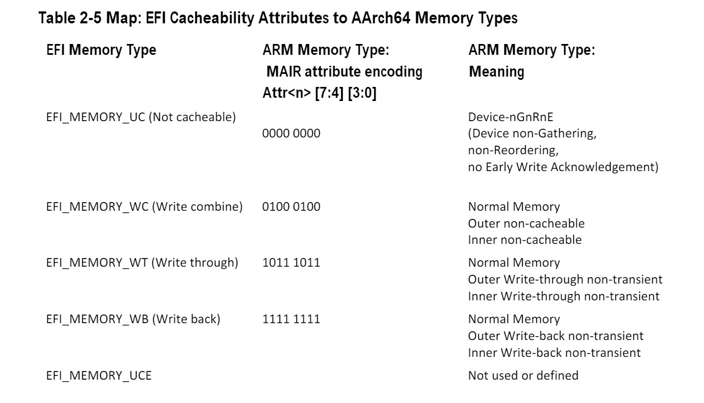

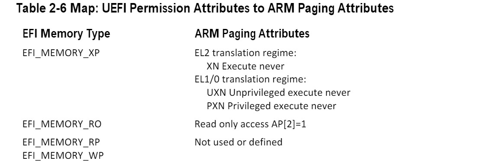

#### 切换状态

```text
X0 – EFI_HANDLE
X1 – EFI_SYSTEM_TABLE *
X30 – Return Address
```

#### 在应用程序中启用分页或备用翻译

启动服务定义了一个特定的执行环境。本节将描述如何编写一个应用程序来创建一个替代的执行环境。一些操作系统要求操作系统加载器能够在启动服务时启用操作系统所需的翻译，并对 UEFI 定义的执行环境进行其他更改。

如果 UEFI 应用程序使用自己的页表，或其他处理器状态，应用程序必须确保固件执行每个被取代的功能。符合本规范的固件有两种方式可以在这种替代的执行环境中执行。

- 明确的固件调用
- 固件通过定时器事件对应用程序进行预控

具有备用执行环境的应用程序可以在每次 UEFI 调用之前恢复固件环境。然而，抢占的可能性可能要求启用替代执行环境的应用程序在替代执行环境处于活动状态时禁用中断。如果应用程序在调用 UEFI 中断 ISR 之前捕捉到中断并恢复 EFI 固件环境，那么启用备用执行环境的应用程序启用中断是合法的。在 UEFI ISR 上下文被执行后，它将返回到备用执行环境启用的应用程序上下文。

由 UEFI 应用程序创建的替代执行环境不得改变 UEFI 固件在调用 ExitBootServices() 之前创建的 MMU 配置的语义或行为，包括页表项的位布局。

在操作系统加载器调用 ExitBootServices() 后，它应该立即配置异常向量以指向适当的代码。

#### 调用约定

AArch64 绑定的基本调用惯例在文件 Procedure Call Standard for the ARM 64-bit Architecture Version A-0.06（或更高版本）中定义。

请参阅 "ARM 64 位基础调用公约 "标题下的 UEFI  [相关文件链接](http://uefi.org/uefi)。

这种绑定方式在这些方面进一步约束了调用惯例。

- AArch64 的执行状态不能被被调用者修改。
- 所有的代码退出，无论是正常的还是特殊的，都必须来自 A64 指令集。
- 可以使用浮点和 SIMD 指令。
- 可选的向量操作和其他指令集扩展只能被使用。
- 在动态地检查它们的存在之后。
- 保存并随后恢复任何额外的执行状态背景。
- 额外的功能启用或控制，如电源，必须明确地管理。
- 只支持 little endian 操作。
- 堆栈将保持 16 字节对齐。
- 结构（或大于 64 位的其他类型）必须通过引用而不是通过值传递。
- EFI AArch64 平台绑定将平台寄存器（r18）定义为 "不使用"。避免在固件中使用 r18 使得代码与操作系统平台 ABI 定义的 r18 的固定作用以及操作系统及其应用程序将 r18 作为临时寄存器的使用兼容。

### RISC-V 平台

所有的函数都是以 C 语言的调用惯例来调用的。更多细节见 2.3.7.3。

在 RISC-V 平台上，目前在 RISC-V 架构中引入了三个特权级别。除了用户权限，主管权限和机器权限涵盖了 RISC-V 系统的所有方面。特权指令也被定义在每个权限级别中。

| 级别 | 编码 | 名称 | 缩写 |
| :----: | :----: | :----: | :----: |
| 0 | 0 | 用户/应用模式 | U |
| 1 | 1 | 管理员模式 | S |
| 2 | 10 | 保留 |   |
| 3 | 11 | 机器模式 | M |

一个 RISC-V 平台可以包含一个或多个 RISC-V 内核和其他组件，如物理内存、固定功能加速器和 I/O 设备。术语 RISC-V 核心是指一个包含独立指令获取单元的组件。一个 RISC-V 核心可以有多个 RISC-V 兼容的硬件线程，或称哈特。在整个 POST 过程中，RISC-V UEFI 固件可以在机器模式或监督者模式下执行，这取决于哈特的能力和平台设计。然而，如果平台被设计为启动 Supervisor 模式的操作系统或操作系统加载器，RISC-V UEFI 固件必须在 POST 初期或后期将启动程序切换到 Supervisor 模式。

机器模式具有最高的权限，该模式是 RISC-V 平台唯一必须的权限级别；所有其他权限级别是可选的，取决于平台的要求。

机器模式是在开机复位时进入的初始特权模式。这个级别在 UEFI 中用于对硬件平台的低级别访问。

UEFI 固件实现可以提供监督者二进制接口（SBI），以允许监督者模式执行环境调用特权功能或访问特权硬件。

在启动服务期间，处理器处于以下执行模式。

- 共有 32 个通用寄存器 x1-x31。寄存器 x0 被硬连接为 0。每个寄存器都有其 ABI（应用二进制接口）名称。更多细节见 2.3.7.3。
- 本机基数整数的宽度取决于 RISC-V 特权模式的实现。
- XLEN 是一个通用术语，用来指基数整数的宽度，单位为比特。
  - 对于 32 位宽度的基础整数 ISA，XLEN = 32
  - 对于 64 位宽度的基础整数 ISA，XLEN = 64
  - 对于 128 位宽度的基础整数 ISA，XLEN = 128
- 处理器寄存器的宽度可以通过将即时的 4 放在寄存器中，然后将寄存器左移，每次移 31 位
来确定。如果一次移位后为零，那么机器就是 RV32。如果两次移位后为零，那么机器就是 RV64，否则就是 RV128。
- 处理器复位向量是平台指定的。在 UEFI 中，它被配置为平台实现定义的复位向量。复位向量地址是 RISC-V 处理器在开机复位时获取的第一条指令。
- 复位后的 mcause 值有特定的实现解释，在不区分不同复位条件的实现中，应该返回 0 值。区分不同复位条件的实现应该只使用 0 来表示最完整的复位（例如，硬复位）。复位的原因可能是开机复位、外部硬复位、检测到断电、看门狗定时器过期、睡眠模式唤醒等，机器模式的 UEFI 系统固件必须区分这些原因。
- mstatus.xIE 表示当前特权模式下的处理器中断激活情况。
  - mstatus.MIE 被设置为 1，而 mstatus.SIE 和 mstatus.UIE 在 UEFI POST 早期阶段被设置为 0
- 在 UEFI 的启动服务中，机器模式中断被启用。有两种中断被启用，一种是定时器中断，另一种是软件中断。
- mie.MSIE = 1
- mie.MTIE = 1
- 该内存处于物理寻址模式。在 UEFI 启动服务期间，页面在 RISC-V 机器模式下被禁用。
- I/O访问是通过内存映射I/O。
- 在 UEFI 中只支持机器级的控制和状态寄存器（CSR）。
- 机器 ISA(misa) 寄存器包含有关 CPU 实现能力的信息。misa.MXL 字段编码了机器模式下的本地基数整数 ISA 宽度。MXLEN（机器 XLEN）是由 misa.MXL 的设置决定的。
  - misa.MXL = 1, MXLEN 为 32 位
  - misa.MXL = 2, MXLEN 为 64 位
  - misa.MXL = 3，MXLEN 为 128 位
- RISC-V 处理器支持广泛的定制和专业化指令集。RISC-V 的变化提供了各种目的的处理器实现，处理器的能力被报告在 misa 寄存器的扩展位中。在执行指定的 RISC-V 扩展指令之前，UEFI 驱动程序需要知道处理器的能力。扩展字段编码标准扩展的存在，每个字母有一个位。 (0 位编码扩展 "A "的存在，1 位编码扩展 "B "的存在，以此类推。

目前，单字母扩展记忆法如下。

- A - 原子扩展
- B - 暂时为比特业务扩展保留。
- C - 压缩扩展
- D - 双精度浮点扩展
- E - 减少的寄存器集指示器 RV32E（16 个寄存器）。
- F - 单精度浮点扩展
- G - 存在额外的标准扩展
- H - 管理程序扩展
- I - RV32I/64I/128I基础ISA
- J - 暂时保留给动态翻译语言扩展。
- K - 保留
- L - 暂时为十进制浮点扩展保留。
- M - 整数乘法和除法扩展
- N - 支持用户级中断
- O - 保留
- P - 暂时为 Packed-SIMD 扩展保留。
- Q - 四精度浮点扩展
- S - 实施监督员模式
- T - 暂时为事务性内存扩展保留。
- U - 实施用户模式
- V - 暂时保留给向量扩展
- W - 保留
- X - 存在非标准扩展
- Y - 保留
- Z - 保留
- Zifenci - 指令 - 取物栅栏
- Zicsr - 控制和状态寄存器访问

机器供应商 ID 注册

- mvendorid 是一个 32 位的只读寄存器，编码零件的制造。值为 0 表示这个字段没有实
施，或这是一个非商业的实施。

机器结构 ID 寄存器

- marchid 是一个 MXLEN 位只读寄存器，编码 hart 的基本微架构。mvendorid 和 marchid 的组合应能唯一地识别所实施的 hart 微架构的类型。

机器实现 ID 寄存器

- 这为处理器实现的版本提供了一个独特的编码。

根据本规范编写的应用程序可以改变处理器的执行模式，但 UEFI 镜像必须确保固件启动服务和运行时服务以规定的执行环境执行。

在操作系统调用 ExitBootServices（）后，固件启动服务不再可用，调用任何启动服务都是非法的。在 ExitBootServices 之后，固件运行服务仍然可用，如果 SetVirtualAddressMap() 已经被调用，描述了固件运行服务使用的所有虚拟地址范围，则可以在启用分页和虚拟地址指针的情况下调用。

如果支持 ACPI。

- 在启动时加载的 ACPI 表可以包含在 EfiACPIReclaimMemory（推荐）或 EfiACPIMemoryNVS 类型的内存中。ACPI FACS 必须包含在 EfiACPIMemoryNVS 类型的内存中
- 系统固件不得为任何类型的内存描述符请求一个虚拟映射。EfiACPIReclaimMemory 或 EfiACPIMemoryNVS。
- EfiACPIReclaimMemory 和 EfiACPIMemoryNVS 类型的 EFI 内存描述符必须在 4KiB 边界上对齐，并且必须是 4KiB 大小的倍数。
- 任何 UEFI 内存描述符通过以下方式请求一个虚拟映射设置了 EFI_MEMORY_RUNTIME 位的 EFI_MEMORY_DESCRIPTOR 必须在 4KiB 边界上对齐，并且必须是 4KiB 大小的倍数。
- ACPI 内存操作区域必须从 UEFI 内存映射中继承可缓存属性。如果系统内存映射不包含缓存属性，ACPI 内存操作区域必须从 ACPI 命名空间中继承其缓存属性。如果在 UEFI 内存映射中不存在可缓存属性，那么系统内存映射或 ACPI 命名空间，那么该区域必须被认为是不可缓存的。

- 在运行时加载的 ACPI 表必须包含在 EfiACPIMemoryNVS 类型的内存中。
  - 运行时加载的 ACPI 表的可缓存属性应该在 UEFI 内存映射中定义。如果 UEFI 内存映射中不存在关于表位置的信息，可以从 ACPI 内存描述符中获得可缓存属性。如果 UEFI 内存映射或 ACPI 内存描述符中没有关于表位置的信息，则假定该表为非缓存的。
- 一般来说，在启动时加载的 UEFI 配置表（例如，SMBIOS 表）可以包含在 EfiRuntimeServicesData（推荐）、EfiBootServicesData、EfiACPIReclaimMemory 或 EfiACPIMemoryNVS 类型的内存中。在运行时加载的表必须包含在 EfiRuntimeServicesData（推荐）或 EfiACPIMemoryNVS 类型的内存中。

**注意**：以前的 EFI 规范允许在运行时加载的 ACPI 表在 EfiReservedMemoryType 中，对于其他 EFI 配置表没有提供指导。EfiReservedMemoryType 不打算被固件使用。UEFI 规范打算澄清未来的情况。另外，只有符合 UEFI 规范的操作系统才能保证处理内存中 EfiBootServicesData 类型的 SMBIOS 表。

#### 交接状态

监督员模式，而内存寻址必须在没有内 存 的 Bare 模式下操作。

通过虚拟页表条目进行地址转换或保护。

UEFI 固件必须向操作系统公开固件数据结构中的 RISC-V boot hart ID。

- 如果平台支持 SMBIOS，那么在 "RISC-V 处理器特定数据"结构中，SMBIOS 类型 44 的记录必须将 "Boot Hart "设置为 1。
- 如果平台支持设备树，设备树必须在/chosen 节点下包含一个无符号整数（32 位）属性"boot- hartid"，它将向主管操作系统指出启动的 hart ID。

如果平台支持设备树结构来描述系统配置，必须在 EFI 配置表中安装扁平化设备 Blob（DTB）（详见 4.6 节） 。

所有的 UEFI 镜像都需要两个参数：UEFI 镜像句柄和 EFI 系统表的指针。根据 RISC-V 的调用惯例，EFI_HANDLE 通过 a0 寄存器传递，EFI_SYSTEM_TABLE 则通过 a1 寄存器传递。

- x10 -EFI_HANDLE(ABI 名称：a0)
- x11 - EFI_SYSTEM_TABLE *(ABI 名称：a1)
- x1 - 返回地址 (ABI 名称：ra)

#### 数据对齐

在 RV32I 和 RV64I 中，数据类型存储在内存中时必须按其自然大小对齐。下表描述了 UEFI 中 RV32I 和 RV64I 的数据类型及其对齐情况。

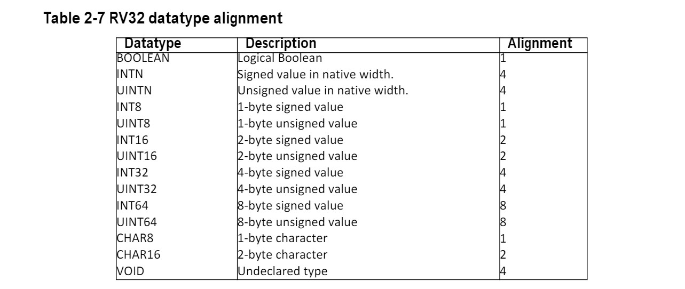

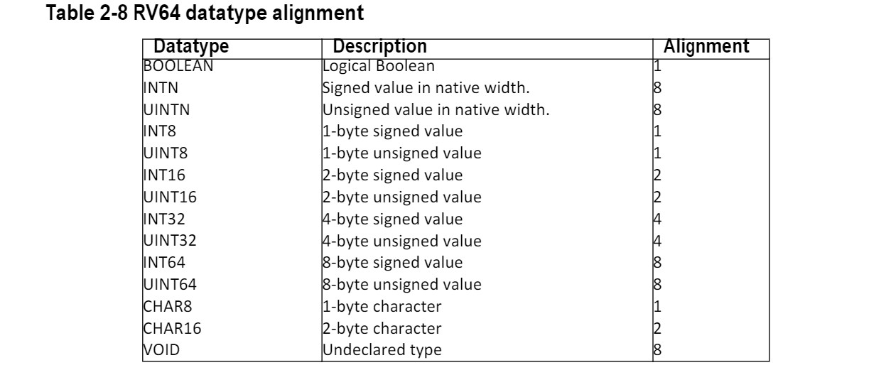

#### 调用约定

RISC-V 的调用惯例在必要时用寄存器传递参数。在 RISC-V 中，总共声明了 32 个通用寄存器，每个寄存器都有其相应的 ABI 名称。

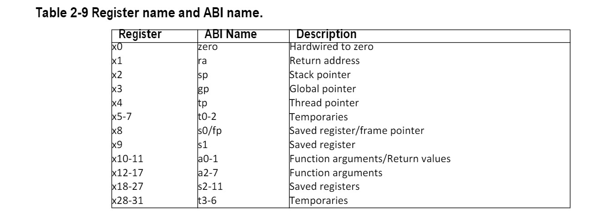

在 RISC-V 的调用惯例中，最多有 8 个整数寄存器用于传递参数，a0-a7。a0-a7 是 ABI 的名称，对应的寄存器是 x10-x17。数值从整数寄存器 a0 和 a1 中返回，这些是寄存器 x10 和 x11。在标准的 RISC-V 调用惯例中，堆栈向下增长，堆栈点总是保持 16 字节对齐。五个整数寄存器 t0-t6 是临时寄存器，在整个调用过程中是不稳定的，如果以后使用，必须由调用者保存。12 个整数寄存器 s0-s11 在不同的调用中保留，如果使用的话必须由被调用者保存。

鉴于以下声明：

"在标准 ABI 中，程序不应该修改整数寄存器 tp 和 gp，因为信号处理程序可能依赖于它们的值"在 RISC-V EFL psABI 规范中提到，RISC-V 的调用惯例是 gp 和 tp 寄存器没有被分配一个特定的所有者来保存和恢复它们的值（见下面的链接），UEFI 固件在任何情况下都不能相信 tp 和 gp 的值，也不能假设拥有对这些寄存器的写入权限。 (如在 EFI 启动服务、EFI 运行时服务、EFI 管理模式服务和任何可能被 EFI 驱动程序、操作系统或外部固件有效载荷调用的 UEFI 固件接口) 。

如果 UEFI 固件需要改变 gp 或 tp 寄存器的值，请保留这些值，并且在 ExitBootServices() 之后不要再碰它们。是否以及如何在 UEFI 固件环境中保存 gp 和 tp 是具体实施的。

参见 "RISC-V EFL psABI 规范 "标题下的 UEFI 规范 [相关文件链接](http://uefi.org/uefi) ，以及 RISC-V Unprivileged ISA 规范中的 RISC-V 汇编程序员手册部分。

## 协议

设备手柄支持的协议是通过 EFI_BOOT_SERVICES.HandleProtocol() 启动服务或
EFI_BOOT_SERVICES.OpenProtocol() 启动服务发现的。每个协议都有一个规范，包括以下内
容。

- 该协议的全球唯一 ID（GUID）。
- 协议接口结构
- 协议服务

除非另有规定，否则协议的接口结构不会从运行时内存中分配，协议成员函数也不应在运行时被调用。如果没有明确规定，一个协议成员函数可以在小于或等于 TPL_NOTIFY 的 TPL 级别下被调用（见第 7.1 节）。除非另有规定，否则一个协议的成员函数不具有可重入性或 MP 安全。

协议成员函数定义的任何状态代码都需要被实现，额外的错误代码可以被返回，但它们不会被标准的符合性测试所测试，任何使用该程序的软件都不能依赖于实现可能提供的任何扩展错误代码。为了确定手柄是否支持任何给定的协议，协议的 GUID 被传递给 HandleProtocol() 或 OpenProtocol()。如果设备支持所请求的协议，将返回一个指向定义的协议接口结构的指针。

协议接口结构将调用者与该设备要使用的特定协议服务联系起来。

图 2-4 显示了一个协议的构造。UEFI 驱动程序包含一个或多个协议实现的特定功能，并将它们注册到启动服务 EFI_BOOT_SERVICES.InstallProtocolInterface()。固件返回协议的协议接口，然后用于调用协议的特定服务。UEFI 驱动程序保持私有的、特定于设备的协议接口的上下文。

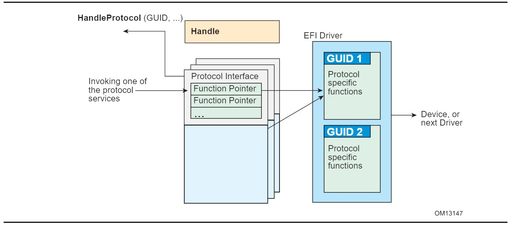

下面的 C 语言代码片段说明了协议的使用

```C
// There is a global “EffectsDevice” structure. This
// structure contains information pertinent to the device.
// Connect to the ILLUSTRATION_PROTOCOL on the EffectsDevice,
// by calling HandleProtocol with the device’s EFI device handle
// and the ILLUSTRATION_PROTOCOL GUID.

EffectsDevice.Handle = DeviceHandle;
Status = HandleProtocol (
    EffectsDevice.EFIHandle,
    &IllustrationProtocolGuid,
    &EffectsDevice.IllustrationProtocol
    );
// Use the EffectsDevice illustration protocol’s “MakeEffects” 
// service to make flashy and noisy effects.

Status = EffectsDevice.IllustrationProtocol->MakeEffects (
    EffectsDevice.IllustrationProtocol,
    TheFlashyAndNoisyEffect
    );
```

表 2-10 列出本规范所定义的 UEFI 协议。

| 协议 | 描述 |
| :----: | :----: |
| EFI_LOADED_IMAGE_PROTOCOL | 提供关于镜像的信息。 |
| EFI_LOADED_IMAGE_DEVICE_PATH_PROTOCOL | 指定通过 EFI Boot Service LoadImage() 加载 PE/COFF 镜像时使用的设备路径。 |
| EFI_DEVICE_PATH_PROTOCOL | 提供设备的位置。 |
| EFI_DRIVER_BINDING_PROTOCOL | 提供服务以确定 UEFI 驱动程序是否支持给定的控制器，以及提供服务以启动和停止给定的控制器。 |
| EFI_DRIVER_FAMILY_OVERRIDE_PROTOCOL | 提供驱动家族覆盖机制，为给定的控制器选择最佳驱动。 |
| EFI_PLATFORM_DRIVER_OVERRIDE_PROTOCOL | 提供一个平台特定的覆盖机制，用于为给定的控制器选择最佳驱动程序。 |
| EFI_BUS_SPECIFIC_DRIVER_OVERRIDE_PROTOCOL | 提供一个针对总线的覆盖机制，以便为给定的控制器选择最佳驱动程序。 |
| EFI_DRIVER_DIAGNOSTICS2_PROTOCOL | 为 UEFI 驱动所管理的控制器提供诊断服务。 |
| EFI_COMPONENT_NAME2_PROTOCOL | 为 UEFI 驱动和驱动所管理的控制器提供人类可读的名称。 |
| EFI_SIMPLE_TEXT_INPUT_PROTOCOL | 支持简单控制台风格文本输入的设备的协议接口。 |
| EFI_SIMPLE_TEXT_OUTPUT_PROTOCOL | 用于支持控制台风格文本显示的设备的协议接口。 |
| EFI_SIMPLE_POINTER_PROTOCOL | 用于鼠标和轨迹球等设备的协议接口。 |
| EFI_SERIAL_IO_PROTOCOL | 用于支持串行字符传输的设备的协议接口。 |
| EFI_LOAD_FILE_PROTOCOL | 用于从任意设备读取文件的协议接口。 |
| EFI_LOAD_FILE2_PROTOCOL | 用于从任意设备读取非启动选项文件协议接口 |
| EFI_SIMPLE_FILE_SYSTEM_PROTOCOL | 用于打开包含 UEFI 文件系统的磁盘卷。 |
| EFI_FILE_PROTOCOL | 提供对支持的文件系统的访问。 |
| EFI_DISK_IO_PROTOCOL | 可分层到任何 BLOCK_IO 或 BLOCK_IO_EX 接口。 |
| EFI_BLOCK_IO_PROTOCOL | 用于支持块I/O风格访问的设备的协议接口。 |
| EFI_BLOCK_IO2_PROTOCOL | 用于支持块状I/O风格访问的设备的协议接口。该接口能够进行非阻塞式交易。 |
| EFI_UNICODE_COLLATION_PROTOCOL | 用于字符串比较操作的协议接口。 |
| EFI_PCI_ROOT_BRIDGE_IO_PROTOCOL | 用于将内存、I/O、PCI 配置和 DMA 访问抽象到 PCI 根桥控制器。 |
| EFI_PCI_IO_PROTOCOL | 用于抽象内存、I/O、PCI 配置和 DMA 访问 PCI 总线上的一个 PCI 控制器。 |
| EFI_USB_IO_PROTOCOL | 用于抽象访问一个 USB 控制器。 |
| EFI_SIMPLE_NETWORK_PROTOCOL | 为支持基于数据包传输的设备提供接口。 |
| EFI_PXE_BASE_CODE_PROTOCOL | 为支持网络启动的设备提供协议接口。 |
| EFI_BIS_PROTOCOL | 在加载和调用启动镜像之前验证它们的协议接口。 |
| EFI_DEBUG_SUPPORT_PROTOCOL | 协议接口，用于保存和恢复处理器上下文，并钩住处理器异常。 |
| EFI_DEBUGPORT_PROTOCOL | 协议接口，抽象出调试主机和调试目标系统之间的字节流连接 |
| EFI_DECOMPRESS_PROTOCOL | 用于解压使用 EFI 压缩算法压缩的镜像。 |
| EFI_EBC_PROTOCOL | 支持 EFI Byte Code 解释器所需的协议接口 |
| EFI_GRAPHICS_OUTPUT_PROTOCOL | 用于支持图形输出的设备的协议接口。 |
| EFI_NVM_EXPRESS_PASS_THRU_PROTOCOL | 允许向 NVM Express 控制器发布 NVM Express 命令的协议接口。 |
| EFI_EXT_SCSI_PASS_THRU_PROTOCOL | 用于 SCSI 通道的协议接口，允许向 SCSI 设备发送 SCSI 请求包 |
| EFI_USB2_HC_PROTOCOL |  用于抽象访问 USB 主机控制器的协议接口。 |
| EFI_AUTHENTICATION_INFO_PROTOCOL | 提供与特定设备路径相关的通用认证信息的访问 |
| EFI_DEVICE_PATH_UTILITIES_PROTOCOL | 帮助创建和操作设备路径。 |
| EFI_DEVICE_PATH_TO_TEXT_PROTOCOL | 将设备节点和路径转换为文本 |
| EFI_DEVICE_PATH_FROM_TEXT_PROTOCOL | 将文本转换为设备路径和设备节点 |
| EFI_EDID_DISCOVERED_PROTOCOL | 包含从视频输出设备检索的 EDID 信息 |
| EFI_EDID_ACTIVE_PROTOCOL | 包含一个活动视频输出设备的 EDID 信息 |
| EFI_EDID_OVERRIDE_PROTOCOL | 由平台产生，允许平台向图形输出协议的生产者提供 EDID 信息  |
| EFI_ISCSI_INITIATOR_NAME_PROTOCOL | 设置和获取 iSCSI 启动器名称 |
| EFI_TAPE_IO_PROTOCOL | 提供控制和访问磁带机的服务 |
| EFI_MANAGED_NETWORK_PROTOCOL |  用于定位 MNP 驱动程序支持的通信设备，并创建和销毁可以使用底层通信设备的 MNP 子协议驱动程序的实例。 |
| EFI_ARP_SERVICE_BINDING_PROTOCOL | 用于定位 ARP 驱动程序支持的通信设备，并创建和销毁 ARP 子协议驱动程序的实例。 |
| EFI_ARP_PROTOCOL | 用于将本地网络协议地址解析为网络硬件地址。 |
| EFI_DHCP4_SERVICE_BINDING_PROTOCOL | 用于定位 EFI DHCPv4 协议驱动程序支持的通信设备，并创建和销毁能够使用底层通信设备的 EFI DHCPv4 协议子驱动程序实例。 |
| EFI_DHCP4_PROTOCOL | 用于收集 EFI IPv4 协议驱动程序的配置信息，并提供 DHCPv4 服务器和 PXE 启动服务器发现服务。 |
| EFI_TCP4_SERVICE_BINDING_PROTOCOL | 用于定位 EFI TCPv4Protocol 驱动，以创建和销毁驱动的子代，与其他使用 TCP 协议的主机通信。 |
| EFI_TCP4_PROTOCOL | 提供发送和接收数据流的服务 |
| EFI_IP4_SERVICE_BINDING_PROTOCOL | 用于定位 EFI IPv4 协议驱动程序支持的通信设备，并创建和销毁可以使用底层通信设备的 EFI IPv4 协议子协议驱动程序的实例。 |
| EFI_IP4_PROTOCOL | 提供基本的网络IPv4数据包I/O服务。 |
| EFI_IP4_CONFIG_PROTOCOL |  EFI IPv4 配置协议驱动程序执行与平台和策略相关的 EFI IPv4 协议驱动程序的配置 |
| EFI_IP4_CONFIG2_PROTOCOL | EFI IPv4 配置 II 协议驱动程序执行与平台和策略相关的 EFI IPv4 协议驱动程序的配置。 |
| EFI_UDP4_SERVICE_BINDING_PROTOCOL | 用于定位 EFI UDPv4 协议驱动程序支持的通信设备，并创建和销毁可以使用底层通信设备的 EFI UDPv4 协议子协议驱动程序的实例。 |
| EFI_UDP4_PROTOCOL | 提供简单的面向数据包的服务，以传输和接收 UDP 数据包。 |
| EFI_MTFTP4_SERVICE_BINDING_PROTOCOL | 用于定位 EFI MTFTPv4 协议驱动程序所支持的通信设备，并创建和销毁可以使用底层通信设备的 EFI MTFTPv4 协议子协议驱动程序的实例 |
| EFI_MTFTP4_PROTOCOL | 为客户端的单播或多播 TFTP 操作提供基本服务 |
| EFI_HASH_PROTOCOL | 允许使用一种或多种哈希算法创建任意消息摘要的哈希值 |
| EFI_HASH_SERVICE_BINDING_PROTOCOL | 用于定位驱动程序提供的散列服务支持，并创建和销毁 EFI 散列协议的实例，以便多个驱动程序能够使用底层散列服务。 |
| EFI_SD_MMC_PASS_THRU_PROTOCOL | 允许SD/eMMC命令被发送到SD/eMMC控制器的协议接口。 |

## UEFI 驱动模型

UEFI 驱动模型旨在简化设备驱动的设计和实现，并产生较小的可执行镜像大小。因此，一些复杂性已被转移到总线驱动器中，并在更大程度上转移到通用固件服务中。

设备驱动程序需要在加载驱动程序的同一镜像句柄上产生一个驱动程序绑定协议。然后，它等待系统固件将驱动程序连接到一个控制器。当这种情况发生时，设备驱动程序负责在控制器的设备句柄上产生一个协议，抽象出控制器所支持的 I/O 操作。总线驱动器执行这些完全相同的任务。此外，总线驱动程序还负责发现总线上的任何子控制器，并为发现的每个子控制器创建一个设备手柄。

一个假设是，系统的结构可以被看作是一组连接到一个或多个核心芯片组的一个或多个处理器。核心芯片组负责产生一个或多个 I/O 总线。UEFI 驱动模型并不试图描述处理器或核心芯片组。相反，UEFI 驱动模型描述了由核心芯片组产生的一组 I/O 总线，以及这些 I/O 总线的任何子代。这些子代可以是设备，也可以是额外的 I/O 总线。这可以被看作是一棵总线和设备的树，核心芯片组在这棵树的根部。

这个树状结构中的叶子节点是执行某种类型的I/O的外围设备。这可能包括键盘、显示器、磁盘、网络，等等。非叶子节点是在设备和总线之间或不同总线类型之间移动数据的总线。图 2-5 显示了

一个有四条总线和六个设备的桌面系统样本。

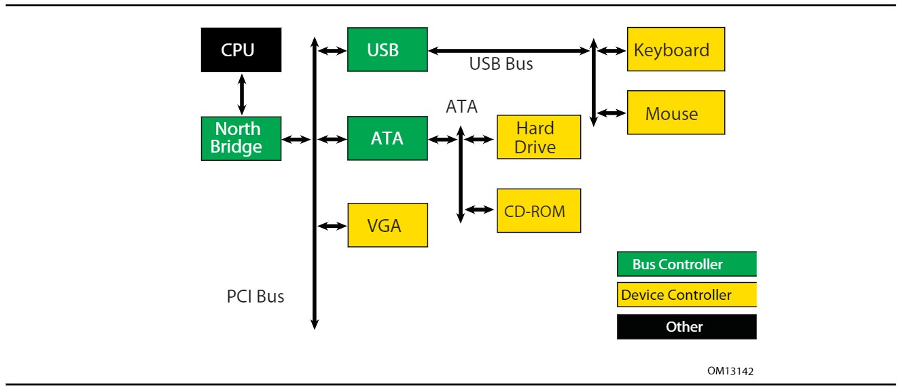

图 2-6 是一个更复杂的服务器系统的例子。我们的想法是使 UEFI 驱动模型变得简单和可扩展，因此像下面这样的更复杂的系统可以在预启动环境中被描述和管理。这个系统包含六条总线和八个设备。

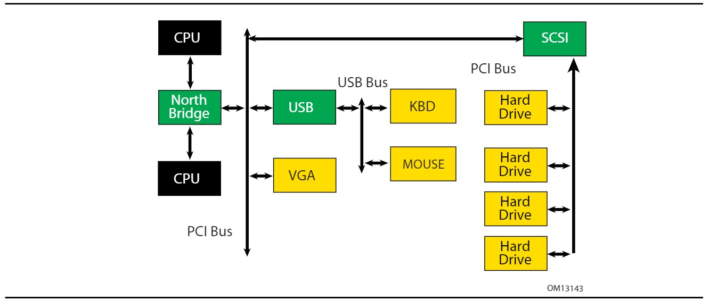

在任何给定的平台中，固件服务、总线驱动器和设备驱动器的组合可能是由各种各样的供应商生产的，包括 OEM、IBV 和 IHV。这些来自不同供应商的不同组件需要一起工作，以产生一个 I/O 设备的协议，可以用来启动一个符合 UEFI 的操作系统。因此，为了提高这些组件的互操作性，UEFI 驱动模型被描述得非常详细。

本节的其余部分是对 UEFI 驱动模型的简要概述。它描述了 UEFI 驱动模型旨在解决的遗留选项 ROM 问题、驱动的入口点、主机总线控制器、设备驱动的属性、总线驱动的属性，以及 UEFI 驱动模型如何适应热插拔事件。

### 遗留 Option ROM 问题

传统的选项 ROM 有很多限制和约束，限制了平台设计者和适配器供应商的创新。在撰写本文时，ISA 和 PCI 适配器都使用传统的选项 ROM。在本讨论中，只考虑 PCI 选项 ROM；传统的 ISA 选项 ROM 在 UEFI 规范中不被支持。

下面列出了传统选项 ROM 的主要约束和限制。对于每一个问题，都列出了设计 UEFI 驱动模型时的考虑。因此，UEFI 驱动模型的设计直接解决了克服 PC-AT 风格的传统选项 ROM 所隐含的限制的解决方案的要求。

#### 32位/16位的真实模式二进制文件

遗留选项 ROM 通常包含 IA-32 处理器的 16 位实模式代码。这意味着 PCI 卡上的传统选项 ROM 不能用在不支持执行 IA-32 实模式二进制文件的平台上。另外，16 位实模式只允许驱动程序直接访问系统内存的低 1 MiB。驱动程序有可能将处理器切换到实模式以外的模式，以便访问 1 MiB 以上的资源，但这需要大量的额外代码，并导致与其他选项 ROM 和系统 BIOS 的互操作性问题。另外，将处理器切换到其他执行模式的选项 ROM 与 Itanium 处理器不兼容。

UEFI 驱动模型的设计考虑。

- 驱动程序需要平坦的内存模式，可以完全访问系统组件。
- 驱动程序需要用 C 语言编写，以便它们在不同的处理器架构之间可以移植。
- 驱动程序可以被编译成虚拟机可执行文件，允许单一二进制驱动程序在使用不同处理器架构的机器上工作。

#### 使用选项 ROM 的固定资源

由于传统选项 ROM 只能直接寻址系统内存的低 1 MiB，这意味着传统选项 ROM 的代码必须存在 1MiB 以下。在 PC-AT 平台上，从 `0x00000-0x9FFFF` 的内存是系统内存。从 `0xA0000-0xBFFFF` 的内存是 VGA 内存，而从 `0xF0000-0xFFFFF` 的内存是为系统 BIOS 保留的。另外，由于多年来系统 BIOS 变得更加复杂，许多平台也将 `0xE0000-0xEFFFF` 用于系统 BIOS。这就为传统选项 ROM 留下了从 `0xC0000-0xDFFFF` 的 128KB 的内存。这限制了在 BIOS POST 期间可以运行多少个传统选项 ROM。

另外，对于传统的选项 ROM 来说，分配系统内存并不容易。它们的选择是：从扩展 BIOS 数据区（EBDA）分配内存，通过后期内存管理器（PMM）分配内存，或者根据启发式搜索空闲内存。其中，只有 EBDA 是标准的，其他的在适配器之间或 BIOS 供应商之间使用不一致，这增加了复杂性和潜在的冲突。

UEFI 驱动模型的设计考虑。

- 驱动程序需要平坦的内存模式，可以完全访问系统组件。
- 驱动程序需要能够被重新定位，以便它们能够被加载到内存的任何地方（PE/COFF 镜像）。
- 驱动程序应该通过启动服务来分配内存。这些都是规范的接口，可以保证在各种平台的实现中都能发挥预期的作用。

#### 将选项 ROM 与它们的设备相匹配

目前还不清楚哪个控制器可能被某个特定的传统选项 ROM 所管理。一些传统的选项 ROM 会在整个系统中搜索要管理的控制器。这可能是一个漫长的过程，取决于平台的大小和复杂性。另外，由于 BIOS 设计的限制，所有的传统选项 ROM 都必须被执行，而且在操作系统启动之前，它们必须扫描所有的外围设备。这也可能是一个漫长的过程，特别是当 SCSI 总线必须扫描 SCSI 设备时。这意味着传统的选项 ROM 正在对平台的初始化方式进行策略决策，哪些控制器由哪些传统的选项 ROM 管理。这使得系统设计者很难预测遗留选项 ROM 将如何相互作用。这也会导致板载控制器的问题，因为一个传统的选项 ROM 可能会错误地选择管理板载控制器。

UEFI 驱动模型的设计考虑。

- 驱动器与控制器的匹配必须是确定性的
- 通过平台驱动覆盖协议和驱动配置协议给 OEM 厂商更多控制权
- 必须能够只启动启动操作系统所需的驱动程序和控制器。

#### 与 PC-AT 系统设计的联系

传统的选项 ROM 假定了一个类似 PC-AT 的系统结构。它们中的许多包括直接触及硬件寄存器的代码。这可能使它们在无遗留问题和无头平台上不兼容。传统的选项 ROM 也可能包含设置程序，这些程序假定有一个类似 PC-AT 的系统结构来与键盘或视频显示器互动。这使得设置程序在无遗留系统和无头平台上不兼容。

UEFI 驱动模型的设计考虑。

- 驱动程序应使用定义明确的协议与系统硬件、系统输入设备和系统输出设备进行交互。

#### 规范中的歧义和经验中的变通方法

由于传统选项 ROM 和系统 BIOS 之间的不兼容，许多传统选项 ROM 和 BIOS 代码包含了变通方法。这些不兼容的情况之所以存在，部分原因是在如何编写传统选项 ROM 或编写系统 BIOS 方面没有明确的规范另外，中断链和启动设备的选择在传统的选项 ROM 中是非常复杂的。并不总是清楚哪个设备会成为操作系统的启动设备。

UEFI 驱动模型的设计考虑。

- 驱动程序和固件的编写要遵循这一规范。由于这两个组件都有明确定义的规范，因此可以开发合规性测试，以证明驱动程序和系统固件是合规的。这将消除在驱动程序或系统固件中建立变通方法的需要（除了那些可能需要解决特定硬件问题的方法）。
- 通过《平台驱动程序覆盖协议》和《驱动程序配置协议》以及其他 OEM 增值组件，让 OEM 拥有更多控制权，以管理启动设备的选择过程。

### 驱动程序初始化

驱动程序镜像的文件必须从某种类型的媒体上加载。这可能包括 ROM、FLASH、硬盘、软盘、CDROM，甚至是网络连接。一旦找到了驱动镜像，就可以通过启动服务 `EFI_BOOT_SERVICES.LoadImage()` 将其加载到系统内存。
`LoadImage()` 将一个 PE/COFF 格式的镜像加载到系统内存。

为驱动程序创建一个句柄，并在该句柄上放置一个加载的镜像协议实例。一个包含加载镜像协议实例的句柄被称为镜像句柄。在这一点上，驱动程序还没有被启动。它只是坐在内存中等待被启动。图 2-7 显示了在调用 `LoadImage()` 后驱动程序的镜像句柄的状态。


在用启动服务 `LoadImage()` 加载了一个驱动程序后，必须用启动服务 `EFI_BOOT_SERVICES.StartImage()` 来启动它。所有类型的 UEFI 应用程序和 UEFI 驱动程序都是如此，它们可以在符合 UEFI 的系统上加载和启动。遵循 UEFI 驱动模型的驱动的入口点必须遵循一些严格的规则。首先，它不允许接触任何硬件。相反，驱动程序只允许在它自己的镜像手柄上安装协议实例。遵循 UEFI 驱动模型的驱动必须在它自己的镜像手柄上安装一个驱动绑定协议的实例。

它可以选择安装驱动配置协议、驱动诊断协议或组件名称协议。此外，如果一个驱动程序希望是可卸载的，它可以选择性地更新加载的镜像协议（见第 9 节），以提供它自己的 `Unload()` 函数。

最后，如果一个驱动程序需要在启动服务 `EFI_BOOT_SERVICES.ExitBootServices()` 被调用时执行任何特殊操作，它可以选择性地创建一个带有通知函数的事件，在启动服务 `ExitBootServices()` 被调用时被触发。一个包含驱动绑定协议实例的镜像手柄被称为驱动镜像手柄。图 2-8 显示了图 2-7 中的镜像处理在启动服务后的可能配置 `StartImage()` 已被调用

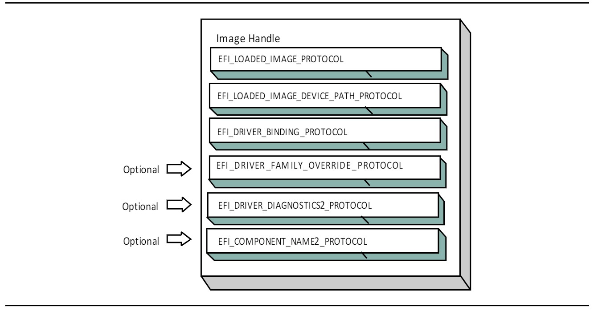

### 主机总线控制器

驱动程序不允许接触任何硬件，在驱动程序的入口点。因此，驱动程序将被加载和启动，但它们都将等待被告知管理系统中的一个或多个控制器。一个平台组件，如启动管理器，负责管理驱动程序与控制器的连接。然而，在进行第一次连接之前，必须要有一些初始的控制器集合供驱动程序管理。这个控制器的初始集合被称为主机总线控制器。主机总线控制器提供的 I/O 抽象是由 UEFI 驱动模型范围之外的固件组件产生的。主机总线控制器的设备手柄和每个控制器的 I/O 抽象必须由平台上的核心固件产生，或者由可能不遵循 UEFI 驱动模型的驱动程序产生。参见 PCI 根桥 I/O 协议规范，了解 PCI 总线的 I/O 抽象的例子。

一个平台可以被看作是一组处理器和一组核心芯片组部件，它们可能产生一个或多个主机总线。

图 2-9 显示了一个有 n 个处理器（CPU）的平台，以及一组产生 m 个主机桥的核心芯片组组件。


每个主机桥在 UEFI 中被表示为一个设备句柄，它包含一个设备路径协议实例，以及一个抽象了主机总线可以执行的 I/O 操作的协议实例。例如，一个 PCI 主机总线控制器支持一个或多个 PCI 根桥，这些根桥是由 PCI 根桥 I/O 协议抽象出来的。图 2-10 显示了一个 PCI 根桥的设备处理实例。


一个 PCI 总线驱动程序可以连接到这个 PCI 根桥，并为系统中的每个 PCI 设备创建子句柄。然后，PCI 设备驱动程序应连接到这些子句柄，并产生 I/O 抽象，可用于启动 UEFI 兼容的操作系统。下面的章节描述了在 UEFI 驱动模型中可以实现的不同类型的驱动。UEFI 驱动模型是非常灵活的，所以这里不会讨论所有可能的驱动类型。相反，主要的类型将被涵盖，可以作为设计和实现其他驱动类型的起点。

设备驱动程序不允许创建任何新的设备句柄。相反，它在现有的设备句柄上安装了额外的协议接口。最常见的设备驱动程序类型是将一个 I/O 抽象附加到一个由总线驱动程序创建的设备句柄上。这个 I/O 抽象可以用来启动一个 UEFI 兼容的操作系统。一些 I/O 抽象的例子包括简单文本输出、简单输入、块 I/O 和简单网络协议。图 2-11 显示了在设备驱动程序连接到它之前和之后的设备手柄。在这个例子中，设备句柄是 XYZ 总线的一个子节点，所以它包含一个 XYZ 总线支持的 I/O 协议。它还包含一个设备路径协议，该协议是由 XYZ 总线驱动程序放在那里的。设备路径协议不是所有设备句柄都需要的。它只对代表系统中物理设备的设备句柄有要求。虚拟设备的句柄将不包含设备路径协议。


连接到图 2-11 中设备句柄的设备驱动程序必须在自己的镜像句柄上安装了一个驱动程序绑定协议。驱动程序绑定协议（见第 11.1 节）包含三个函数，称为 `Supported()`、`Start()` 和 `Stop()`。`Supported()` 函数测试驱动程序是否支持一个给定的控制器。在这个例子中，驱动程序将检查设备手柄是否支持设备路径协议和 XYZ I/O协议。如果一个驱动程序的`Supported()`函数通过了，那么该驱动程序就可以通过调用驱动程序的 Start() 函数连接到控制器。Start() 函数实际上是将额外的 I/O 协议添加到设备句柄中。在这个例子中，块 I/O 协议正在被安装。为了提供对称性，驱动程序绑定协议也有一个 Stop() 函数，迫使驱动程序停止管理一个设备句柄。这将导致设备驱动卸载任何在 Start() 中安装的协议接口。

EFI 驱动绑定协议的 `Supported()`、`Start()` 和 `Stop()` 函数需要利用启动服务 `EFI_BOOT_SERVICES.OpenProtocol()` 来获取协议接口，启动服务 `EFI_BOOT_SERVICES.CloseProtocol()` 来释放一个协议接口。

`OpenProtocol()` 和 `CloseProtocol()` 更新由系统固件维护的句柄数据库，以跟踪哪些驱动程序正在消费协议接口。把柄数据库中的信息可以用来检索有关驱动程序和控制器的信息。新的启动服务 `EFI_BOOT_SERVICES.OpenProtocolInformation()` 可以用来获取当前正在消费特定协议接口的组件列表。

### 总线驱动

从 UEFI 驱动模型的角度来看，总线驱动和设备驱动几乎是相同的。唯一的区别是，总线驱动为总线驱动在其总线上发现的子控制器创建新的设备手柄。因此，总线驱动比设备驱动稍微复杂一些，但这反过来又简化了设备驱动的设计和实现。总线驱动器有两种主要类型。第一种是在第一次调用 `Start()` 时为所有子控制器创建句柄。另一种类型允许在多次调用 `Start()` 时为子控制器创建句柄。第二种类型的总线驱动器在支持快速启动能力方面非常有用。它允许创建几个子手柄或甚至一个子手柄。在那些需要很长时间来列举所有子节点的总线上（比如 SCSI），这可以为平台的启动节省很大的时间。图 2-12 显示了在调用 `Start()` 之前和之后的总线控制器的树状结构。进入总线控制器节点的虚线代表与总线控制器的父控制器的链接。如果该总线控制器是一个主机总线控制器，那么它就没有一个父控制器。节点 A、B、C、D 和 E 代表总线控制器的子控制器。

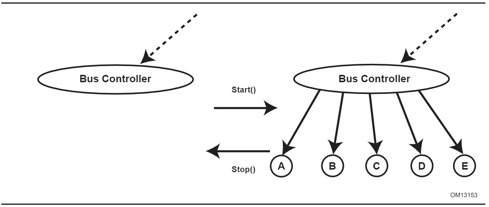

一个支持在每次调用 `Start()` 时创建一个孩子的总线驱动器可能会选择先创建孩子 C，然后是孩
子 E，然后是剩下的孩子 A、B 和 D。

总线驱动器必须在创建的每个子控制器上安装协议接口。至少，它必须安装一个协议接口，为子
控制器提供一个总线服务的I/O抽象。如果总线驱动程序创建的子句柄代表一个物理设备，那么总线驱动程序也必须在子句柄上安装一个设备路径协议实例。总线驱动器可以选择在每个子手柄上安装一个总线特定的驱动程序覆盖协议。这个协议是在驱动程序连接到子控制器时使用的。启动服务 `EFI_BOOT_SERVICES.ConnectController()` 使用架构上定义的优先级规则来为给定的控制器选择最佳的驱动程序集。总线特定驱动程序覆盖协议的优先级高于一般的驱动程序搜索算法，而低于平台覆盖协议的优先级。一个总线特定驱动程序选择的例子发生在 PCI 上。PCI 总线驱动程序使存储在 PCI 控制器的选项 ROM 中的驱动程序比存储在平台其他地方的驱动程序具有更高的优先权。图 2-13 显示了一个子设备句柄的例子，它是由支持总线特定驱动程序覆盖机制的 XYZ 总线驱动程序创建的

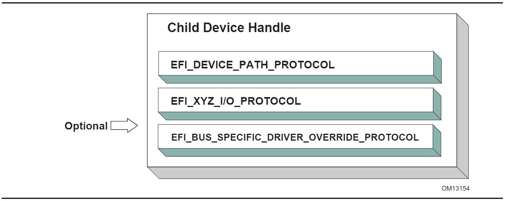

### 平台组件

在 UEFI 驱动模型下，连接和断开驱动与平台中的控制器的行为是在平台固件的控制下进行的。这通常是作为 UEFI 启动管理器的一部分来实现的，但其他实现也是可能的。平台固件可以使用启动服务 `EFI_BOOT_SERVICES.ConnectController()` 和 `EFI_BOOT_SERVICES.DisconnectController()` 来决定哪些控制器被启动，哪些没有。如果平台希望执行系统诊断或安装操作系统，那么它可以选择将驱动程序连接到所有可能的启动设备。如果一个平台希望启动一个预装的操作系统，它可以选择只将驱动程序连接到启动所选操作系统所需的设备上。UEFI 驱动模型通过启动服务 `ConnectController()` 和 `DisconnectController()` 支持这两种操作模式。此外，由于负责启动的平台组件是平台必须与控制台设备和启动选项的设备路径一起工作，UEFI 驱动模型中涉及的所有服务和协议都在考虑设备路径的情况下进行了优化。

由于平台固件可以选择只连接生产控制台所需的设备，并获得对启动设备的访问，所以操作系统现在的设备驱动程序不能假设设备的 UEFI 驱动程序已经被执行。在系统固件或选项 ROM 中出现的 UEFI 驱动并不能保证 UEFI 驱动会被加载、执行，或被允许管理平台中的任何设备。所有操作系统中的设备驱动必须能够处理已经被 UEFI 驱动管理的设备和没有被 UEFI 驱动管理的设备。

平台也可以选择产生一个名为平台驱动程序覆盖协议的协议。这与总线专用驱动程序覆盖协议类似，但它的优先级更高。这使平台固件在决定哪些驱动程序连接到哪些控制器时具有最高优先权。平台驱动程序覆盖协议被连接到系统中的一个句柄。如果系统中存在该协议，启动服务
`ConnectController()` 将使用该协议。

### 热插拔事件

在过去，系统固件不需要处理预启动环境中的热插拔事件。然而，随着像 USB 这样的总线的出现
，终端用户可以在任何时候添加和移除设备，重要的是要确保在 UEFI 驱动模型中可以描述这些类型的总线。这取决于支持热添加和删除设备的总线的总线驱动程序是否为这类事件提供支持。对于这些类型的总线，一些平台管理将不得不转移到总线驱动器中。例如，当键盘被热添加到平台上的 USB 总线上时，终端用户会希望键盘处于活动状态。USB 总线驱动程序可以检测到热添加事件并为键盘设备创建一个子句柄。然而，因为除非 `EFI_BOOT_SERVICES.ConnectController()` 被调用，否则驱动程序不会被连接到控制器，键盘不会成为一个活动的输入设备。让键盘驱动成为活动设备需要 USB 总线驱动在发生热添加事件时调用 `ConnectController()`。此外，当发生热移除事件时，USB 总线驱动程序将不得不调用 `EFI_BOOT_SERVICES.DisconnectController()`。如果 `EFI_BOOT_SERVICES.DisconnectController()` 返回错误，USB 总线驱动程序需要从一个定时器事件中重试 `EFI_BOOT_SERVICES.DisconnectController()`，直到它成功。

设备驱动程序也会受到这些热插拔事件的影响。在 USB 的情况下，一个设备可以在没有任何通知的情况下被移除。这意味着，USB 设备驱动程序的 Stop() 函数将不得不处理关闭一个不再存在于系统中的设备的驱动程序的问题。因此，任何未完成的 I/O 请求将不得不被刷新，而实际上无法接触到设备硬件。

一般来说，增加对热插拔事件的支持会大大增加总线驱动和设备驱动的复杂性。添加这种支持取决于驱动程序的编写者，因此需要将驱动程序的额外复杂性和大小与预启动环境中对该功能的需求进行权衡

### EFI 服务绑定

UEFI 驱动模型可以很好地映射到硬件设备、硬件总线控制器，以及在硬件设备之上的软件服务的简单组合。然而，UEFI 驱动模型并不能很好地映射到复杂的软件服务组合上。因此，对于更复杂的软件服务组合，需要一套额外的补充协议。

图 2-14 包含了三个例子，显示了软件服务相互之间的不同方式。在前两种情况下，每个服务消耗一个或多个其它服务，并且最多一个其它的服务消耗所有的服务。

`EFI_DRIVER_BINDING_PROTOCOL` 可以用来模拟案例#1 和#2，但它不能用来模拟案例#3，因为 UEFI 启动服务 `OpenProtocol()` 的行为方式。当与 `BY_DRIVER` 开放模式一起使用时，`OpenProtocol()` 允许每个协议最多只有一个消费者。这个功能非常有用，可以防止多个驱动程序试图管理同一个控制器。然而，这使得产生像案例 3 那样的软件服务集变得困难。

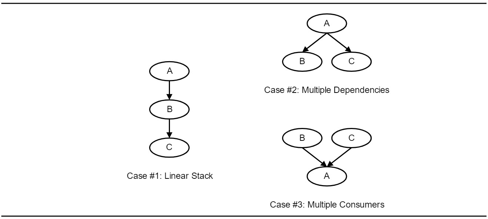

`EFI_SERVICE_BINDING_PROTOCOL` 提供的机制允许协议有一个以上的消费者。
`EFI_SERVICE_BINDING_PROTOCOL` 与 `EFI_DRIVER_BINDING_PROTOCOL` 一起使用。一个 UEFI 驱动程序产生的协议需要同时提供给一个以上的消费者，将同时产生 `EFI_DRIVER_BINDING_PROTOCOL` 和 `EFI_SERVICE_BINDING_PROTOCOL`。这种类型的驱动程序是一种混合驱动程序，它将在其驱动程序入口点中产生 `EFI_DRIVER_BINDING_PROTOCOL`。当驱动程序收到开始管理一个控制器的请求时，它将在被启动的控制器的句柄上产生 `EFI_SERVICE_BINDING_PROTOCOL`。`EFI_SERVICE_BINDING_PROTOCOL` 与 UEFI 规范中定义的其他协议略有不同。它没有一个与之相关的 GUID。相反，这个协议实例结构实际上代表了一个协议系列。每个需要 `EFI_SERVICE_BINDING_PROTOCOL` 实例的软件服务驱动程序都需要为自己的 `EFI_SERVICE_BINDING_PROTOCOL` 类型生成一个新的 GUID。这一要求就是本规范中的各种网络协议包含两个 GUID 的原因。一个是该网络协议的 `EFI_SERVICE_BINDING_PROTOCOL` GUID，另一个 GUID 是包含网络驱动程序产生的特定成员服务的协议。这里定义的机制不限于网络协议驱动程序。它可以应用于 `EFI_DRIVER_BINDING_PROTOCOL` 不能直接映射的任何协议集，因为这些协议包含一个或多个关系，如图 2-14 中的案例#3。无论是 `EFI_DRIVER_BINDING_PROTOCOL` 还是组合 `EFI_DRIVER_BINDING_PROTOCOL` 和 `EFI_SERVICE_BINDING_PROTOCOL` 可以处理圆形的依赖关系。有一些方法可以允许循环引用，但它们要求循环链接在短时间内存在。当使用跨越循环链接的协议时，这些方法还要求协议必须以 `EXCLUSIVE` 的开放模式打开，这样，任何试图通过调用 `DisconnectController()` 来解构协议集的行为都会失败。一旦驱动完成了跨循环链路的协议，该协议就应该被关闭。

## 要求

本文件是一个架构规范。因此，在实现中保留了最大的灵活度。但是，有一些要求，这个规范的元素必须被实现，以确保操作系统加载器和其他设计成与 UEFI 启动服务一起运行的代码可以依赖一个一致的环境。为了描述这些要求，这个规范被分成了必要的和可选的元素。一般来说，一个可选的元素在与该元素名称相匹配的章节中被完全定义。然而，对于必需的元素，在少数情况下，定义可能不完全包含在为特定元素命名的部分中。在实现必要元素时，应该注意涵盖本规范中定义的与特定元素相关的所有语义。

### 必要元素

表 2-11 列出了所需必要元素。任何符合本规范的系统，都必须实现这些元素。这意味着所有必要的服务功能和协议都必须存在，并且实现必须为所有的调用和参数组合提供规范中定义的全部语义。应用程序、驱动程序或操作系统加载器，他们可以假设所有这些系统都实现了所有的必要要素

系统供应商可能会选择不实现所有要求的元素，例如，在专门的系统配置上，不支持要求的元素所隐含的所有服务和功能。然而，由于大多数应用程序、驱动程序和操作系统加载器的编写是假设所有必要的元素都存在于实现 UEFI 规范的系统上；任何这样的代码都可能需要明确的定制，以运行在对该规范中所要求的元素的不完全实现。

### 平台特定的元素

根据平台所需的特定功能，可以添加或删除许多元素。平台固件开发者需要根据所包含的功能来实现 UEFI 元素。以下是可能的平台特征和每种特征类型所需的要素清单：

1. 如果一个平台包括控制台设备，必须实现`EFI_SIMPLE_TEXT_INPUT_PROTOCOL`、`EFI_SIMPLE_TEXT_INPUT_EX_PROTOCOL`和`EFI_SIMPLE_TEXT_OUTPUT_PROTOCOL`。
2. 如果一个平台包括一个配置基础设施，那么`EFI_HII_DATABASE_PROTOCOL`,`EFI_HII_STRING_PROTOCOL`, `EFI_HII_CONFIG_ROUTING_PROTOCOL`, `EFI_HII_CONFIG_ACCESS_PROTOCOL`是必须的。如果你支持位图字体，你必须支持`EFI_HII_FONT_PROTOCOL`。
3. 如果一个平台包括图形控制台设备，那么必须实现 `EFI_GRAPHICS_OUTPUT_PROTOCOL`、`EFI_EDID_DISCOVERED_PROTOCOL` 和 `EFI_EDID_ACTIVE_PROTOCOL`。为了支持 `EFI_GRAPHICS_OUTPUT_PROTOCOL`，一个平台必须包含一个驱动程序来消费 `EFI_GRAPHICS_OUTPUT_PROTOCOL` 并产生 `EFI_SIMPLE_TEXT_OUTPUT_PROTOCOL`，即使 `EFI_GRAPHICS_OUTPUT_PROTOCOL` 是由一个外部驱动程序产生的。
4. 如果一个平台包括一个指针设备作为其控制台支持的一部分，`EFI_SIMPLE_POINTER_PROTOCOL` 必须被实现。
5. 如果一个平台包括从磁盘设备启动的能力，那么就需要 `EFI_BLOCK_IO_PROTOCOL`、`EFI_DISK_IO_PROTOCOL`、`EFI_SIMPLE_FILE_SYSTEM_PROTOCOL` 以及 `EFI_UNICODE_COLLATION_PROTOCOL`。此外，必须实现对 `MBR`、`GPT` 和 El `Torito` 的分区支持。对于支持 SPC-4 或 ATA8-ACS 命令集安全命令的磁盘设备，还需要 `EFI_STORAGE_SECURITY_COMMAND_PROTOCOL`。（TODO 原文多了下划线）外部驱动程序可以产生块 I/O 协议和 `EFI_STORAGE_SECURITY_COMMAND_PROTOCOL`。所有其他从磁盘设备启动所需的协议必须作为平台的一部分进行。
6. 如果一个平台可以从网络设备 TFTP 启动，那么就需要 `EFI_PXE_BASE_CODE_PROTOCOL`。平台必须准备好在 `EFI_NETWORK_INTERFACE_IDENTIFIER_PROTOCOL(UNDI)`、`EFI_SIMPLE_NETWORK_PROTOCOL` 或 `EFI_MANAGED_NETWORK_PROTOCOL` 中的任何一种上产生这个协议。如果平台包括验证通过网络设备收到的启动镜像的能力。也需要支持镜像验证，包括 *`SetupMode`* 等于 0，启动镜像的哈希值或镜像对应的验证证书存在于'db'变量而不是'dbx'变量中。一个外部驱动可以产生 UNDI 接口。从网络设备启动所需的所有其他协议必须由平台来执行。
7. 如果一个平台支持 UEFI 通用网络应用，那么 `EFI_MANAGED_NETWORK_PROTOCOL`, `EFI_MANAGED_NETWORK_SERVICE_BINDING_PROTOCOL`, `EFI_ARP_PROTOCOL`, `EFI_ARP_SERVICE_BINDING_PROTOCOL`, `EFI_DHCP4_PROTOCOL`, `EFI_DHCP4_SERVICE_BINDING_PROTOCOL`。 `EFI_TCP4_PROTOCOL`, `EFI_TCP4_SERVICE_BINDING_PROTOCOL`, `EFI_IP4_PROTOCOL`, `EFI_IP4_SERVICE_BINDING_PROTOCOL`, `EFI_IP4_CONFIG2_PROTOCOL`, `EFI_UDP4_PROTOCOL` 和 `EFI_UDP4_SERVICE_BINDING_PROTOCOL` 是必需的。如果该平台需要额外的 IPv6 支持，那么需要 `EFI_DHCP6_PROTOCOL、EFI_DHCP6_SERVICE_BINDING_PROTOCOL`、`EFI_TCP6_PROTOCOL`、`EFI_TCP6_SERVICE_BINDING_PROTOCOL`。`EFI_IP6_PROTOCOL`、`EFI_IP6_SERVICE_BINDING_PROTOCOL`、`EFI_IP6_CONFIG_PROTOCOL`、`EFI_UDP6_PROTOCOL` 和 `EFI_UDP6_SERVICE_BINDING_PROTOCOL` 是额外要求的。如果网络应用需要 DNS 功能，`EFI_DNS4_SERVICE_BINDING_PROTOCOL` 和 `EFI_DNS4_PROTOCOL` 是 IPv4 协议栈的必备条件。IPv6 协议栈需要 `EFI_DNS6_SERVICE_BINDING_PROTOCOL` 和 `EFI_DNS6_PROTOCOL`。如果网络环境需要 `TLS` 功能，需要 `EFI_TLS_SERVICE_BINDING_PROTOCOL`、`EFI_TLS_PROTOCOL` 和 `EFI_TLS_CONFIGURATION_PROTOCOL`。如果网络环境需要 `IPSEC` 功能，需要 `EFI_IPSEC_CONFIG_PROTOCOL` 和 `EFI_IPSEC2_PROTOCOL`。如果网络环境需要 VLAN 功能，需要 `EFI_VLAN_CONFIG_PROTOCOL`。
8. 如果一个平台包括一个字节流设备，如 UART，那么 `EFI_SERIAL_IO_PROTOCOL` 必须被实现。
9. 如果一个平台包括 PCI 总线支持，那么 `EFI_PCI_ROOT_BRIDGE_IO_PROTOCOL`，`EFI_PCI_IO_PROTOCOL`，必须被实现。
10. 如果一个平台包括 USB 总线支持，那么必须实现 `EFI_USB2_HC_PROTOCOL` 和 `EFI_USB_IO_PROTOCOL`。一个外部设备可以通过产生一个 USB 主机控制器协议来支持 USB。
11. 如果一个平台包括一个 NVM Express 控制器，那么必须实现 `EFI_NVM_EXPRESS_PASS_THRU_PROTOCOL`。
12. 如果一个平台支持从面向块的 NVM Express 控制器启动，那么必须实现 `EFI_BLOCK_IO_PROTOCOL`。一个外部驱动程序可以产生 `EFI_NVM_EXPRESS_PASS_THRU_PROTOCOL`。从 NVM Express 子系统启动所需的所有其他协议必须由平台携带。
13. 如果一个平台包括一个利用 SCSI 命令包的 I/O 子系统，那么`EFI_EXT_SCSI_PASS_THRU_PROTOCOL`必须被实现。
14. 如果一个平台支持从面向块的 SCSI 外设启动，那么必须实现 `EFI_SCSI_IO_PROTOCOL` 和 `EFI_BLOCK_IO_PROTOCOL`。一个外部驱动程序可以产生 `EFI_EXT_SCSI_PASS_THRU_PROTOCO`L。从 SCSI I/O子系统启动所需的所有其他协议必须由平台携带。
15. 如果一个平台支持从 iSCSI 外围启动，那么必须实现 `EFI_ISCSI_INITIATOR_NAME_PROTOCOL` 和 `EFI_AUTHENTICATION_INFO_PROTOCOL`。
16. 如果一个平台包括调试功能，那么 `EFI_DEBUG_SUPPORT_PROTOCOL`、`EFI_DEBUGPORT_PROTOCOL` 和 EFI 镜像信息表必须被实现。
17. 如果一个平台包括将默认驱动程序覆盖到 UEFI 驱动程序模型提供的控制器匹配算法的能力，那么必须实现 `EFI_PLATFORM_DRIVER_OVERRIDE_PROTOCOL`。
18. 如果一个平台包括一个利用 ATA 命令包的 I/O 子系统，那么必须实现`EFI_ATA_PASS_THRU_PROTOCOL`。
19. 如果一个平台支持来自非永久连接到平台的设备的选项 ROM，并且支持验证这些选项 ROM 的能力，那么它必须支持《网络协议-UDP 和 MTFTP》中描述的选项 ROM 验证方法和第 8.1.1 节中描述的验证 EFI 变量。
20. 如果一个平台包括验证 UEFI 镜像的能力，并且该平台可能支持一个以上的操作系统加载器，它必须支持网络协议--UDP 和 MTFTP 中描述的方法以及第 8.1.1 节中描述的验证 UEFI 变量。
21. 从 UEFI 规范 2.8 版开始，不再需要 EBC 支持。如果一个 EBC 解释器被实现，那么它必须产生 `EFI_EBC_PROTOCOL` 接口。
22. 如果一个平台包括从网络设备执行基于 HTTP 的启动的能力，那么就需要 `EFI_HTTP_SERVICE_BINDING_PROTOCOL`、`EFI_HTTP_PROTOCOL` 和 `EFI_HTTP_UTILITIES_PROTOCOL`。如果它包括从网络设备执行基于 HTTPS 的启动的能力，除了上述协议，还需要 `EFI_TLS_SERVICE_BINDING_PROTOCOL`、`EFI_TLS_PROTOCOL` 和 `EFI_TLS_CONFIGURATION_PROTOCOL`。如果它包括执行基于 HTTP(S) 的启动和 DNS 功能的能力，那么 IPv4 堆栈需要 `EFI_DNS4_SERVICE_BINDING_PROTOCOL`、`EFI_DNS4_PROTOCOL`；IPv6 堆栈需要 EFI_DNS6_SERVICE_BINDING_PROTOCOL 和 EFI_DNS6_PROTOCOL。
23. 如果一个平台包括从具有 EAP 功能的网络设备执行无线启动的能力，并且如果该平台提供独立的无线 EAP 驱动程序，则需要 `EFI_EAP_PROTOCOL`、`EFI_EAP_CONFIGURATION_PROTOCOL` 和 `EFI_EAP_MANAGEMENT2_PROTOCOL`；如果该平台提供独立的无线请求器，则需要 `EFI_SUPPLICANT_PROTOCOL` 和 `EFI_EAP_CONFIGURATION_PROTOCOL`。如果它包括使用 TLS 功能进行无线启动的能力，那么需要 `EFI_TLS_SERVICE_BINDING_PROTOCOL`、`EFI_TLS_PROTOCOL` 和 `EFI_TLS_CONFIGURATION_PROTOCOL`。
24. 如果一个平台支持经典蓝牙，那么必须实现 `EFI_BLUETOOTH_HC_PROTOCOL`、`EFI_BLUETOOTH_IO_PROTOCOL` 和 `EFI_BLUETOOTH_CONFIG_PROTOCOL`，并且可以实现 `EFI_BLUETOOTH_ATTRIBUTE_PROTOCOL`。如果一个平台支持 Bluetooth Smart (Bluetooth Low Energy)，那么必须实现 `EFI_BLUETOOTH_HC_PROTOCOL`、`EFI_BLUETOOTH_ATTRIBUTE_PROTOCOL` 和 `EFI_BLUETOOTH_LE_CONFIG_PROTOCOL`。如果一个平台同时支持蓝牙经典和蓝牙 LE，那么上述两个要求都应该得到满足。
25. 如果一个平台支持通过 HTTP 或通过带内路径与 BMC 进行 RESTful 通信，那么必须实现 `EFI_REST_PROTOCOL` 或 `EFI_REST_EX_PROTOCOL`。如果 `EFI_REST_EX_PROTOCOL` 被实现，`EFI_REST_EX_SERVICE_BINDING_PROTOCOL` 也必须被实现。如果一个平台支持通过 HTTP 或通过带内路径与 BMC 进行 Redfish 通信，可以实现 `EFI_REDFISH_DISCOVER_PROTOCOL` 和 `EFI_REST_JSON_STRUCTURE_PROTOCOL`。
26. 如果一个平台包括使用硬件功能来创建高质量的随机数的能力，这种能力应该通过 `EFI_RNG_PROTOCOL` 的实例暴露出来，至少有一种 EFI RNG 算法被支持。
27. 如果一个平台允许安装加载选项变量（Boot####，或 Driver####，或 SysPrep####），该平台必须支持和识别变量内所有定义的属性值，并在 `BootOptionSupport` 中报告这些能力。如果一个平台支持安装 Driver####类型的加载选项变量，所有安装的 Driver####变量必须被处理，并在每次启动时加载和初始化指定的驱动程序。而且所有安装的 SysPrep####选项必须在处理 Boot####选项之前被处理。
28. 如果平台支持 UEFI 安全启动，如安全启动和驱动程序签名中所述，平台必须提供第 37.4 节中描述的 PKCS 验证功能。
29. 如果一个平台包括一个利用SD或eMMC命令包的I/O子系统，那么必须实现`EFI_SD_MMC_PASS_THRU_PROTOCOL`。
30. 如果一个平台包括创建/销毁指定的RAM磁盘的能力，EFI_RAM_DISK_PROTOCOL必须被实现，并且这个协议只存在一个实例。
31. 如果一个平台包括一个支持在指定范围内基于硬件擦除的大容量存储设备，那么必须实现 `EFI_ERASE_BLOCK_PROTOCOL`。
32. 如果一个平台包括在调用 ResetSystem 时注册通知的功能，那么必须实现 `EFI_RESET_NOTIFICATION_PROTOCOL`。
33. 如果一个平台包括 UFS 设备，必须实现 `EFI_UFS_DEVICE_CONFIG_PROTOCOL`。
34. 如果一个平台在调用 *`ExitBootServices()`* 后不能支持 `EFI_RUNTIME_SERVICES` 中定义的调用，该平台允许提供这些运行时服务的实现，在运行时调用时返回 `EFI_UNSUPPORTED`。在这样的系统上，应该发布一个 `EFI_RT_PROPERTIES_TABLE` 配置表，描述哪些运行时服务在运行时被支持。
35. 如果平台包括对具有相干内存的 CXL 设备的支持，那么平台必须支持从设备中提取相干设备属性表（CDAT），使用 CXL 数据对象交换服务（如 CXL 2.0 规范中定义的）或安装在该设备上的 EFI_ADAPTER_INFORMATION_PROTOCOL 实例（具有 EFI_ADAPTER_INFO_CDAT_TYPE_GUID 类型）。

**注意**：一些所需的协议实例是由相应的服务绑定协议创建的。例如，`EFI_IP4_PROTOCOL` 是由 EFI_IP4_SERVICE_BINDING_PROTOCOL 创建。详细情况请参考服务绑定协议的相应章节。

### 驱动程序的特定要素

有一些 UEFI 元素可以被添加或删除，这取决于特定驱动程序所需的功能。驱动程序可以由平台固件开发者实现，以支持特定平台的总线和设备。驱动程序也可以由附加卡供应商实现，用于可能被集成到平台硬件中的设备或通过扩展槽添加到平台中的设备。

下面的列表包括可能的驱动程序特性，以及每种特性类型所需的 UEFI 元素。

1. 如果一个驱动程序遵循本规范的驱动程序模型，就必须实现 `EFI_DRIVER_BINDING_PROTOCOL`。强烈建议所有遵循本规范的驱动程序模型的驱动程序也实现 `EFI_COMPONENT_NAME2_PROTOCOL`。
2. 如果一个驱动程序需要配置信息，该驱动程序必须使用 `EFI_HII_DATABASE_PROTOCOL`。驱动程序不应该以其他方式向用户显示信息或向用户请求信息。
3. 如果一个驱动程序需要诊断，必须实现 `EFI_DRIVER_DIAGNOSTICS2_PROTOCOL`。为了支持低启动时间，在正常启动期间限制诊断。耗时的诊断应该推迟到调用 `EFI_DRIVER_DIAGNOSTICS2_PROTOCOL` 时进行。
4. 如果一个总线支持能够为驱动程序提供容器的设备（例如，选项 ROM），那么该总线类型的总线驱动程序必须实现 `EFI_BUS_SPECIFIC_DRIVER_OVERRIDE_PROTOCOL`。
5. 如果为控制台输出设备编写驱动程序，那么必须实现 `EFI_SIMPLE_TEXT_OUTPUT_PROTOCOL`。
6. 如果为图形控制台输出设备编写驱动程序，则必须实现 `EFI_GRAPHICS_OUTPUT_PROTOCOL`、`EFI_EDID_DISCOVERED_PROTOCOL` 和 `EFI_EDID_ACTIVE_PROTOCOL`。
7. 如果为控制台输入设备编写驱动程序，那么必须实现 `EFI_SIMPLE_TEXT_INPUT_PROTOCOL` 和 `EFI_SIMPLE_TEXT_INPUT_EX_PROTOCOL`。
8. 如果为一个指针设备编写驱动程序，那么必须实现 `EFI_SIMPLE_POINTER_PROTOCOL`。
9. 如果为网络设备编写驱动程序，那么必须实现 `EFI_NETWORK_INTERFACE_IDENTIFIER_PROTOCOL`、`EFI_SIMPLE_NETWORK_PROTOCOL` 或 `EFI_MANAGED_NETWORK_PROTOCOL`。如果硬件中支持 VLAN，那么网络设备的驱动程序可以实现 `EFI_VLAN_CONFIG_PROTOCOL`。如果网络设备选择只产生 `EFI_MANAGED_NETWORK_PROTOCOL`，那么网络设备的驱动程序必须实现 `EFI_VLAN_CONFIG_PROTOCOL`。如果为网络设备编写驱动，除了上述协议外，还提供无线功能，`EFI_ADAPTER_INFORMATION_PROTOCOL` 必须实现。如果无线驱动程序不提供用户配置功能，必须实现 `EFI_WIRELESS_MAC_CONNECTION_II_PROTOCOL`。如果无线驱动程序是为提供独立的无线 EAP 驱动程序的平台编写的，则必须实现 `EFI_EAP_PROTOCOL`。
10. 如果为磁盘设备编写驱动程序，那么必须实现 `EFI_BLOCK_IO_PROTOCOL` 和 `EFI_BLOCK_IO2_PROTOCOL`。此外，对于支持 SPC-4 或 ATA8-ACS 命令集安全命令的磁盘设备，必须实现 `EFI_STORAGE_SECURITY_COMMAND_PROTOCOL`。此外，对于在主机存储控制器中支持倾斜加密的设备，必须支持 `EFI_BLOCK_IO_CRYPTO_PROTOCOL`。
11. 如果为磁盘设备编写驱动程序，那么必须实现 `EFI_BLOCK_IO_PROTOCOL` 和 `EFI_BLOCK_IO2_PROTOCOL`。此外，`EFI_STORAGE_SECURITY_COMMAND_PROTOCOL` 必须用于支持 SPC-4 或 ATA8-ACS 命令集安全命令的磁盘设备。
12. 如果为一个不是面向块的设备编写的驱动程序，但它可以提供一个类似文件系统的接口，那么必须实现 `EFI_SIMPLE_FILE_SYSTEM_PROTOCOL`。
13. 如果为 PCI 根桥编写驱动程序，那么 `EFI_PCI_ROOT_BRIDGE_IO_PROTOCOL` 和 `EFI_PCI_IO_PROTOCOL` 必须被实现。
14. 如果为 NVM Express 控制器编写驱动程序，那么必须实现 `EFI_NVM_EXPRESS_PASS_THRU_PROTOCOL`。
15. 如果为 USB 主机控制器编写驱动程序，那么必须实现 `EFI_USB2_HC_PROTOCOL` 和 `EFI_USB_IO_PROTOCOL`。如果为 USB 主机控制器编写驱动程序，那么必须实现该。
16. 如果为 SCSI 控制器编写驱动程序，那么必须实现 `EFI_EXT_SCSI_PASS_THRU_PROTOCOL`。
17. 如果一个驱动程序是数字签名的，它必须在 PE/COFF 镜像中嵌入数字签名，如第 1691 页的 "嵌入式签名"所述。
18. 如果为一个不是面向块的设备、基于文件系统的设备或控制台设备的启动设备编写驱动程序，那么必须实现 `EFI_LOAD_FILE2_PROTOCOL`。
19. 如果一个驱动遵循本规范的驱动模型，并且该驱动想为用户产生警告或错误信息，那么必须使用 `EFI_DRIVER_HEALTH_PROTOCOL` 来产生这些信息。启动管理器可以选择向用户显示这些信息。
20. 如果一个驱动程序遵循本规范的驱动程序模型，并且该驱动程序需要执行不属于正常初始化序列的修复操作，并且该修复操作需要很长一段时间，那么必须使用 `EFI_DRIVER_HEALTH_PROTOCOL` 来提供修复功能。如果 Boot Manager 检测到一个需要修复操作的启动设备，那么 Boot Manager 必须使用 `EFI_DRIVER_HEALTH_PROTOCOL` 来执行修复操作。在驱动器执行修复操作时，Boot Manager 可以选择性地显示进度指示器。
21. 如果一个驱动程序遵循本规范的驱动程序模型，并且该驱动程序要求用户在使用该驱动程序所管理的启动设备之前进行软件和/或硬件配置的改变，那么必须产生 `EFI_DRIVER_HEALTH_PROTOCOL`。如果 Boot Manager 检测到一个启动设备需要软件和/或硬件配置的改变以使该启动设备可用，那么 Boot Manager 可以选择允许用户进行这些配置的改变。
22. 如果为一个 ATA 控制器编写驱动程序，那么必须实现 `EFI_ATA_PASS_THRU_PROTOCOL`。
23. 如果一个驱动程序遵循本规范的驱动程序模型，并且在为控制器选择最佳驱动程序时，该驱动程序希望以高于总线特定驱动程序覆盖协议的优先级使用，那么 `EFI_DRIVER_FAMILY_OVERRIDE_PROTOCOL` 必须与 `EFI_DRIVER_BINDING_PROTOCOL` 产生在同一把手上。
24. 如果一个驱动程序支持外部代理或应用程序的固件管理，那么必须使用 `EFI_FIRMWARE_MANAGEMENT_PROTOCOL` 来支持固件管理。
25. 如果一个驱动程序遵循本规范的驱动程序模型，并且一个驱动程序是第 2.5 节中定义的设备驱动程序，它必须通过父级总线驱动程序产生的总线抽象协议执行总线事务。因此，符合 PCI 规范的设备的驱动程序必须使用 `EFI_PCI_IO_PROTOCOL` 进行所有的 PCI 内存空间、PCI I/O、PCI配置空间和DMA操作。
26. 如果为经典蓝牙控制器编写驱动程序，那么必须实现 `EFI_BLUETOOTH_HC_PROTOCOL`、`EFI_BLUETOOTH_IO_PROTOCOL` 和 `EFI_BLUETOOTH_CONFIG_PROTOCOL`，并且可以实现 `EFI_BLUETOOTH_ATTRIBUTE_PROTOCOL`。如果是为 Bluetooth Smart（Bluetooth Low Energy）控制器编写的驱动程序，则必须实现 `EFI_BLUETOOTH_HC_PROTOCOL`、`EFI_BLUETOOTH_ATTRIBUTE_PROTOCOL` 和 `EFI_BLUETOOTH_LE_CONFIG_PROTOCOL`。如果一个驱动程序同时支持蓝牙经典和蓝牙 LE，那么上述两个要求都应该得到满足。
27. 如果为 SD 控制器或 eMMC 控制器编写驱动程序，那么必须实现 `EFI_SD_MMC_PASS_THRU_PROTOCOL`。
28. 如果为 UFS 设备编写驱动程序，那么必须实现 `EFI_UFS_DEVICE_CONFIG_PROTOCOL`。

### 在其他地方发布的对本规范的扩展

随着时间的推移，本规范已被扩展，包括对新设备和技术的支持。正如该规范的名称所暗示的那样，其定义的初衷是为固件接口创建一个可扩展的基线，而不需要在本规范的主体中包含扩展。

本规范的读者可能会发现，本规范没有处理某个功能或设备类型。这并不一定意味着在声称符合本规范的实现中，没有约定的 "标准 "方式来支持该特征或设备。有时，其他标准组织发布他们自己的扩展可能更合适，这些扩展旨在与这里的定义协同使用。例如，与等待本规范的修订相比，这样做可以更及时地支持新的功能，或者说，这种支持是由一个在该主题领域具有特殊专长的团体来定义的。因此，建议读者在创建自己的扩展之前，向适当的标准小组询问，以确定是否已经存在适当的扩展出版物。

举例来说，在撰写本规范时，UEFI 论坛知道有一些扩展出版物与本规范兼容，并为其设计。这些扩展包括：

*基于 Itanium®架构的服务器的开发者接口指南*：由 DIG64 小组发布和主持（见 "基于 Itanium®架构的服务器的开发者接口指南 "标题下的 "与 UEFI  [相关文件链接](http://uefi.org/uefi)。该文件是一套技术指南，定义了基于 Itanium™的服务器的硬件、固件和操作系统的兼容性。

*TCG EFI 平台规范*：由 Trusted Computing Group 发布和主持（见 "TCG EFI 平台规范 "标题下的”UEFI [相关文件链接](http://uefi.org/uefi)“。这份文件是关于启动 EFI 平台和在该平台上启动操作系统的过程。具体来说，本规范包含了将启动事件测量到 TPM> PCR 和将启动事件条目添加到事件日志的要求。

*TCG EFI 协议规范*：由 Trusted Computing Group 发布和主持（参见 "UEFI  [相关文件链接](http://uefi.org/uefi)。. 本文件定义了 EFI 平台上 TPM 的标准接口。

其他的扩展文件可能存在于 UEFI 论坛的视野之外，也可能是在本文件最后一次修订之后创建的。
